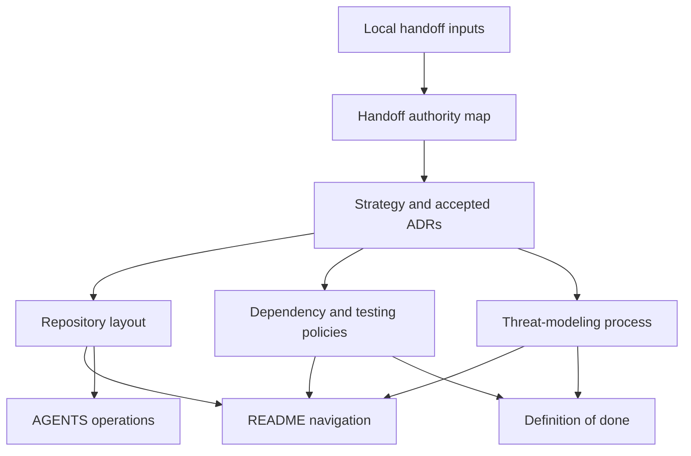
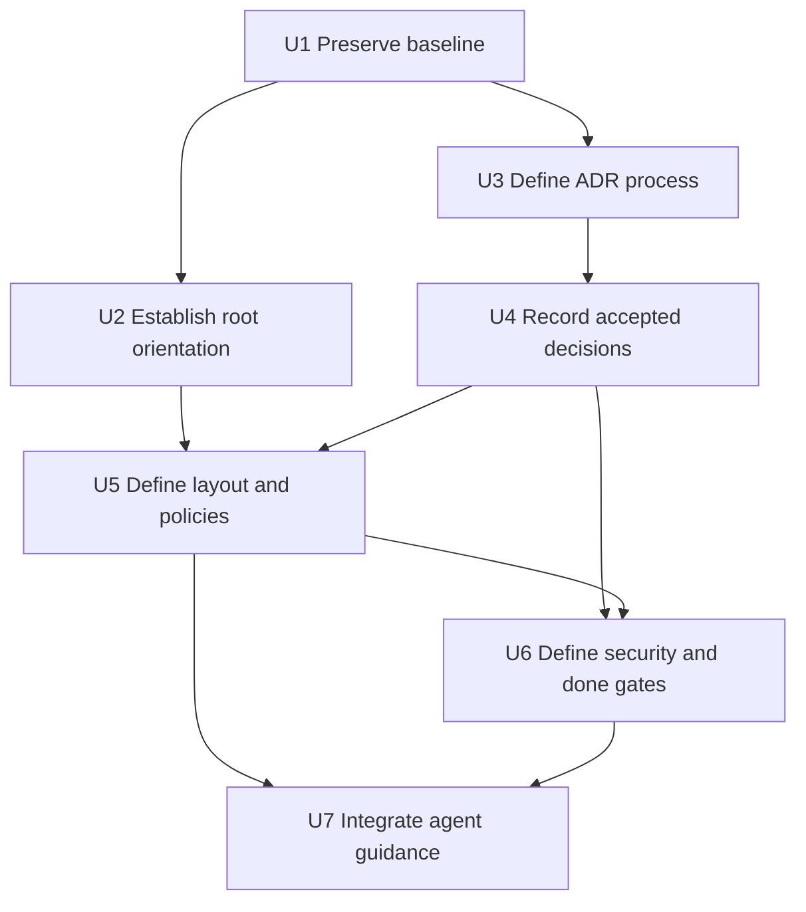

# Repository Foundation and Architectural Contracts - Plan

## Goal Capsule

- **Objective:** Establish a repository-native foundation for `identity-stack` that makes its product boundaries, architecture, ownership, security process, dependency policy, testing expectations, and contributor workflow reviewable before functional implementation begins.
- **Product provenance:** The local handoff input, plus the maintainer's confirmed Apache-2.0 license, Compound Engineering example configuration, monorepo-oriented ownership layout, reporting channel, and local-only handoff policy. The Product Contract and resulting repository-native documents are the maintained authorities.
- **Scope boundary:** Milestone 1 is documentation and repository contracts only; it does not scaffold services, run upstream components, or implement identity or authorization behavior.
- **Execution profile:** Documentation-only repository work. Use Git, `rg`, shell content checks, and `ce-setup`; do not introduce a runtime, formatter, CI workflow, or test harness to validate this milestone.
- **Stop conditions:** Stop if a later-milestone decision becomes necessary, a settled decision conflicts with verified component behavior, preservation checks fail for `LICENSE`, `NOTICE`, or the local handoff, or a handoff would become tracked.
- **Tail ownership:** Implement and verify locally only after maintainer approval. Do not commit, push, or open a pull request unless separately requested.
- **Open blockers:** None. Later-milestone decisions remain explicitly deferred and do not block this plan.

---

## Product Contract

### Summary

Milestone 1 will turn the decisions carried through the local handoff into a concise repository foundation: root entry points, strategy, agent guidance, ADRs, ownership boundaries, security and dependency processes, testing policy, and an implementation-ready plan.

### Problem Frame

The repository currently contains a committed Apache-2.0 license, a maintainer-provided untracked `NOTICE`, and an untracked architectural handoff. The notice is intended for version control; handoffs are not. Without repository-native contracts, later work could silently reopen settled architecture, choose incompatible conventions opportunistically, or bury security and upgrade obligations in local continuity files.

The foundation must make later milestones easier to execute without pretending that runtimes, deployment packaging, public APIs, data ownership, or complete threat models have already been designed.

### Key Decisions

- **Apache-2.0 for project-owned source** (session-settled: user-directed — chosen over leaving the license open: the repository already carries Apache-2.0 and the maintainer explicitly confirmed it). Governs R2.
- **Tracked Compound Engineering example configuration** (session-settled: user-approved — chosen over omitting repository-local workflow discoverability: the inert template documents optional preferences while real local configuration remains untracked). Governs R3.
- **Documented monorepo-oriented ownership layout without placeholder directories** (session-settled: user-approved — chosen over either leaving ownership implicit or scaffolding speculative components: later work gets durable boundaries without premature implementation). Governs R7, R14.
- **Root README without a CONTRIBUTING file** (session-settled: user-directed — chosen over adding both files: the README provides the human entry point while shared completion rules live in project documentation and `AGENTS.md` stays agent-focused). Governs R12, R13, R17.
- **Local-only handoffs under `docs/handoffs/`** (session-settled: user-directed — chosen over committing continuity artifacts or listing them in `.gitignore`: `.git/info/exclude` keeps the rule local while repository-native documents own durable policy). Governs R1.
- **GitHub Private Vulnerability Reporting** (session-settled: user-approved — chosen over publishing a personal email: the repository uses GitHub's structured private advisory channel and a root security policy). Governs R19.
- **Dedicated secrets-handling policy and handoff authority map** (session-settled: user-approved — chosen over scattering these rules across agent guidance and threat-model documents: each concern gets one durable owner). Governs R1, R18.
- **One deployment per realm; no built-in tenancy.** Organizations remain authorization objects within a realm, not deployment isolation boundaries. Governs R4.
- **Kratos owns human identity lifecycle and SpiceDB owns authorization decisions called from application code.** Oathkeeper and Keto are excluded. Governs R5.
- **An Elixir modular-monolith control plane fills shared platform gaps; Hydra remains optional.** Consuming applications retain product-domain ownership. Governs R6.
- **Upstream services remain unmodified and independently upgradeable.** Exact releases or immutable digests, compatibility evidence, and explicit upgrade procedures replace vendoring or moving production targets. Governs R9.

### Requirements

**Repository authority and contributor workflow**

- R1. Preserve the complete source handoff locally at `docs/handoffs/identity-stack-handoff.md`, exclude `docs/handoffs/` through `.git/info/exclude` rather than `.gitignore`, never stage or commit handoff files, and maintain a committed `docs/project/handoff-authority-map.md` that maps handoff topics to current repository authorities or explicit deferrals.
- R2. Record Apache-2.0 as the confirmed license for project-owned source, preserve the maintainer-provided root `NOTICE` as a version-controlled project notice, and require the dependency policy to preserve applicable upstream licenses, notices, and attribution.
- R3. Add `.compound-engineering/config.example.yaml` from the installed Compound Engineering template, keep `.compound-engineering/config.local.yaml` optional and untracked, and document that `docs/` is the default artifact root unless a valid repository-local setting changes it.
- R4. Capture deployment-per-realm and the explicit rejection of built-in tenancy in an ADR.
- R5. Capture Kratos identity ownership, direct application-to-SpiceDB authorization, fail-closed protected operations, and the exclusion of Oathkeeper and Keto in ADRs without designing later interfaces.
- R6. Capture the Elixir control-plane boundary, consuming-application domain ownership, optional Hydra profile, and modular-monolith preference in ADRs.

**Repository shape and durable policy**

- R7. Document a monorepo-oriented target layout assigning ownership for control-plane code, shared Elixir packages, upstream configuration, SpiceDB schemas, tests, deployment assets, runbooks, plans, security material, and ADRs without creating placeholder implementation directories.
- R8. Provide a concise root `STRATEGY.md` that states the target problem, approach, intended adopters, success signals, current investment track, milestone direction, and explicit non-goals without turning into a feature backlog.
- R9. Define a dependency and version-pinning policy covering exact releases or immutable image digests, compatibility matrices, contract and integration evidence, migration rehearsal, security advisories, upstream license and attribution obligations, and staged promotion where supported. Automation-dependent mechanisms remain explicitly inactive until corresponding tooling exists.
- R10. Define a layered testing strategy for unit, contract, integration, migration, and end-to-end tests, including negative and dependency-failure cases and a rule that commands remain unspecified until the corresponding toolchain exists.
- R11. Document a security and threat-modeling process that identifies trust boundaries and security assumptions per milestone; requires review for authentication, authorization, privacy, privileged operations, credentials, external integrations, and data changes; records entry-point access controls, credential lifecycle, and sensitive-data handling; and does not claim that a complete threat model exists before interfaces do.
- R12. Define a repository-wide definition of done covering acceptance criteria, appropriate tests, formatting and static analysis, security and privacy review, compatibility and migration impact, operational behavior, documentation, attribution, simplification, review, and compounding reusable lessons.
- R13. Provide a short root `AGENTS.md` with repository navigation, currently approved read-only and documentation-validation commands, toolchain-aware testing and formatting expectations, security constraints, documentation conventions, and a link to the Milestone 1 definition of done; it must not invent build commands or duplicate shared completion rules.
- R14. Keep Milestone 1 free of production features, speculative extension frameworks, vendored upstream source, and empty future-service scaffolding.

**Planning and verification**

- R15. Produce an implementation-ready Milestone 1 plan with exact files, dependency-ordered reviewable units, verification commands, acceptance traceability, and a stop for maintainer approval before implementation.
- R16. Treat unresolved decisions that affect only later milestones as documented deferrals rather than silently selecting them or blocking this foundation.
- R17. Add a concise root `README.md` that states the project purpose and routes readers to strategy, architecture decisions, repository layout, policies, security process, plans, decision provenance, license, and agent guidance without duplicating those authorities.
- R18. Add `docs/policies/secrets-handling.md` as the repository authority for keeping credentials out of tracked files, using inert example values, local secret-file exclusion, environment separation, least privilege, rotation and revocation ownership, log redaction, and response to accidental disclosure.
- R19. Add a root `SECURITY.md` that directs private reports through GitHub Private Vulnerability Reporting, states the current supported-version posture, requests useful report details, and does not publish a personal email address.

### Acceptance Examples

- AE1. **Covers R7, R14.** Given a new contributor reads the repository layout, when they look for ownership of SpiceDB schemas or deployment assets, then the documentation names their future locations and owners without those directories existing merely as placeholders.
- AE2. **Covers R10, R13.** Given no Elixir or container toolchain has been established, when `AGENTS.md` and the testing policy list verification expectations, then they describe applicable layers and documentation checks without claiming that `mix`, Compose, or another project command is currently available.
- AE3. **Covers R11.** Given a later milestone introduces an authentication or authorization interface, when its plan is reviewed, then the documented security process requires a scoped threat-model update and failure-mode analysis rather than relying on a supposedly complete Milestone 1 threat model.
- AE4. **Covers R3.** Given a contributor wants Compound Engineering preferences, when they inspect `.compound-engineering/config.example.yaml`, then they can copy selected settings locally while the actual local file remains outside version control.
- AE5. **Covers R16.** Given a later-milestone question such as the production database or public API style, when Milestone 1 documentation mentions it, then the item remains visibly open and no ADR presents an accidental choice as settled.
- AE6. **Covers R12, R13, R17.** Given a human or agent enters at the repository root, when they follow the README or agent guidance, then each shared rule has one documented owner and no `CONTRIBUTING.md` is required to discover the workflow.
- AE7. **Covers R1.** Given a local handoff exists under `docs/handoffs/`, when Git inventory and ignore behavior are checked, then the handoff is excluded through `.git/info/exclude`, absent from the tracked-output inventory, and its topics map to a committed authority or deferral.
- AE8. **Covers R11, R18, R19.** Given a contributor or external researcher encounters security-sensitive material, when they follow repository policy, then credentials remain out of tracked examples and vulnerability details go through GitHub's private reporting form rather than a public issue or personal email.

### Success Criteria

- A cold reader can identify the project purpose, component boundaries, rejected architectural alternatives, target repository ownership, security-planning expectations, dependency policy, test layers, and definition of done without consulting chat history.
- A planner can begin Milestone 2 without reopening Milestone 1 decisions or mistaking deferred choices for approved architecture.
- Every proposed Milestone 1 file has an explicit owner, verification method, and acceptance link in this implementation plan.

### Scope Boundaries

Milestone 1 excludes:

- Elixir/Phoenix project creation, application modules, shared-client implementation, database schemas, migrations, or executable tests.
- Kratos, SpiceDB, or Hydra runtime configuration; Docker Compose or production deployment definitions; and compatibility claims for versions not yet selected and verified.
- Application registry, accounts and profiles, organizations, administration, audit storage, privacy workflows, operational deployment, or OAuth/OIDC functionality.
- Resolution of the production database, API contract style, initial administrative UI, shared-profile boundary, privacy jurisdictions and retention periods, audit storage/export design, production packaging, aggregate versioning, and minimum runtime versions.
- Empty directories or placeholder files whose only purpose is to reserve later implementation structure.
- A root `CONTRIBUTING.md`; shared completion rules belong in `docs/project/definition-of-done.md` for this milestone.
- Committing any file under `docs/handoffs/`; local continuity artifacts are never part of the tracked repository output.

### Dependencies and Assumptions

- The installed Compound Engineering plugin version is 3.21.4; its health check resolved `docs/` as the default artifact root and identified the tracked example configuration as missing.
- The existing committed `LICENSE` is the canonical Apache-2.0 license text for project-owned source.
- The maintainer-provided root `NOTICE` is an intentional project attribution artifact and remains part of the repository foundation.
- The public GitHub repository has Private Vulnerability Reporting enabled; `SECURITY.md` is the human-facing reporting policy.
- Markdown is the repository documentation format for Milestone 1.
- Later plans may revise the provisional milestone order, but they may not silently overturn settled architectural constraints.

### Outstanding Questions

#### Deferred to Later Milestones

- Supported production database topology and credentials isolation.
- REST, GraphQL, or deliberately limited combined public API contract.
- Initial administrative interface shape.
- Shared versus application-owned profile attributes.
- Initial privacy jurisdictions and retention periods.
- Audit integrity, storage, and export format.
- Production deployment packaging and first GCP reference shape.
- Aggregate and client-package release/versioning policy.
- Minimum supported Elixir, OTP, database, and container-runtime versions.

### Sources

- Local continuity source — contains project intent, settled architecture, open decisions, milestone decomposition, and the initial assignment; implementation relocates it to the ignored generic handoff path without changing its bytes.
- `LICENSE` — committed Apache License 2.0 text, confirmed by the maintainer as the project-owned source license.
- `NOTICE` — maintainer-provided project copyright notice, confirmed as intentional during plan review.

---

## Planning Contract

### Product Contract Preservation

Changed after review and maintainer confirmation: R1 now makes handoffs local-only under `docs/handoffs/`; R2 makes `NOTICE` a version-controlled project notice; R9, R11, and R13 clarify their owning contracts; R17 and AE6 add the root README without `CONTRIBUTING.md`; and R18, R19, AE7, and AE8 add the approved secrets and vulnerability-reporting contracts.

### Key Technical Decisions

- KTD1. **Local handoffs provide continuity; current documents own live policy.** Move the source handoff byte-for-byte to `docs/handoffs/identity-stack-handoff.md`, exclude the directory only through `.git/info/exclude`, and use `docs/project/handoff-authority-map.md` to map its topics to tracked authorities or explicit deferrals. Covers R1, R2.
- KTD2. **Use a constrained ADR lifecycle and repository template.** `docs/architecture/README.md` owns numeric IDs, YAML frontmatter with a lowercase `status` value, required metadata and sections, allowed status transitions, immutability after acceptance or rejection, and supersession by a new ADR. ADRs record consequences, qualitative reversal cost, confirmation or fitness checks, and observable revisit triggers. The initial settled decisions enter as accepted records. Covers R4-R6, R9.
- KTD3. **Document future ownership in one layout authority.** (session-settled: user-approved — chosen over implicit ownership or speculative directories: the layout must guide later work without creating it). `docs/architecture/repository-layout.md` owns the target monorepo map; implementation directories remain absent per R7 and R14.
- KTD4. **Separate root navigation, agent operations, and shared completion rules.** (session-settled: user-directed — chosen over adding `CONTRIBUTING.md`: the maintainer approved README only). `README.md` routes humans, `AGENTS.md` contains agent-specific navigation and commands, and `docs/project/definition-of-done.md` owns shared completion rules. Covers R12, R13, R17.
- KTD5. **Use documentation-native verification.** The milestone uses Git diff checks, byte hashes, ignore checks, `rg` assertions, link inspection, and `ce-setup`. It does not add a formatter, link checker, Makefile, CI workflow, or runtime solely to manufacture validation commands. Covers R10, R13-R15.
- KTD6. **Threat modeling is incremental and traceable.** `docs/security/threat-modeling.md` owns change triggers and review gates; `docs/security/threat-model-template.md` records scope, actors, assets, data flows, trust boundaries, security assumptions with validation evidence and invalidation triggers, entry-point authentication and authorization, credential lifecycle, sensitive-data protections, threats, disposition, owner, evidence, residual risk, and re-review conditions. Milestone 1 states known coarse boundaries and its incompleteness. Covers R11, R12, R18.
- KTD7. **Compatibility is an evidence ledger, not a forecast.** Deployed containers will use readable tags paired with immutable digests; untested component tuples remain unknown. The dependency policy defines future inventory, update evidence, migration, rollback or restore disposition, vulnerability handling, upstream license and attribution obligations, and SBOM expectations without selecting versions now. Automated dependency-update pull requests are a required future capability when dependency-update tooling is introduced, but no such automation is active in Milestone 1. Covers R2, R9, R16.
- KTD8. **Testing policy is boundary-led.** Unit, contract, integration, migration, and end-to-end layers each have an owner, dependency reality, gate, and evidence type. Contract and real-version integration evidence support compatibility claims; test doubles alone do not. Covers R5, R9, R10.
- KTD9. **Security reports use GitHub's private advisory channel.** Root `SECURITY.md` directs reporters to Private Vulnerability Reporting, avoids public issue disclosure and personal-email publication, and states that no released versions exist yet. Covers R19.
- KTD10. **Secrets handling has one policy owner.** `docs/policies/secrets-handling.md` owns repository hygiene and lifecycle requirements while scoped threat models apply those rules to concrete interfaces and deployments. Covers R11, R18.

### High-Level Technical Design

The repository uses a pointer-first authority model. Root files help readers find the owning document instead of restating it.



Implementation proceeds from authorities to derived guidance so later files link to documents that already exist.



### Output Structure

```text
.
├── .compound-engineering/
│   └── config.example.yaml
├── .gitignore
├── AGENTS.md
├── LICENSE
├── NOTICE
├── README.md
├── SECURITY.md
├── STRATEGY.md
└── docs/
    ├── architecture/
    │   ├── README.md
    │   ├── adr-template.md
    │   ├── repository-layout.md
    │   └── decisions/
    │       ├── 0001-one-deployment-per-realm.md
    │       ├── 0002-kratos-identity-lifecycle.md
    │       ├── 0003-spicedb-application-authorization.md
    │       ├── 0004-elixir-control-plane.md
    │       ├── 0005-optional-hydra-profile.md
    │       ├── 0006-exclude-oathkeeper-and-keto.md
    │       └── 0007-upstream-upgrade-independence.md
    ├── plans/
    │   └── 2026-08-14-001-docs-repository-foundation-plan.md
    ├── policies/
    │   ├── dependency-management.md
    │   ├── secrets-handling.md
    │   └── testing-strategy.md
    ├── project/
    │   ├── definition-of-done.md
    │   └── handoff-authority-map.md
    └── security/
        ├── threat-model-template.md
        └── threat-modeling.md
```

The tree declares the complete tracked Milestone 1 output. `docs/handoffs/` is a local-only ignored directory and never appears in this inventory. A substantive lesson created by the compounding workflow under `docs/solutions/` is the only conditional addition; no empty solutions scaffold is created. Future code, configuration, schema, test, and deployment paths appear only inside `docs/architecture/repository-layout.md` until a later approved milestone creates them.

### ADR Contract

Each ADR uses YAML frontmatter with a stable numeric ID, title, lowercase `status` value, decision date, and owners or decision-makers. Its body includes context and scope, decision drivers, considered options, decision and rationale, consequences, qualitative reversal cost, confirmation or fitness checks, observable revisit triggers, and related ADRs.

Allowed lifecycle transitions are `proposed` to `accepted` or `rejected`, and `accepted` to `deprecated` or `superseded`. A superseded ADR links its successor. Accepted and rejected bodies are immutable except for lifecycle metadata and successor links; a changed decision gets a new ADR. An option considered and not chosen remains inside the owning ADR rather than becoming a separate rejected ADR.

### Security Review Contract

Threat-model updates are required when a milestone changes authentication, authorization, privacy-sensitive data, privileged operations, credentials, external integrations, persistence or data classification, trust boundaries, or security-relevant dependencies.

Each scoped model records its security assumptions, the evidence used to validate them, and the conditions that invalidate them and require review.

Each new entry point records its authentication requirement, permitted actors and operations, privileged authorization decision, unauthenticated and unauthorized behavior, and fail-closed negative tests. Sensitive data is inventoried with classification, owner, sources and sinks, transit and at-rest protections, logging and redaction rules, and retention and deletion status. Credential handling records storage and injection, least privilege, environment separation, rotation and revocation, and log redaction.

Every identified threat receives a documented disposition: mitigate, avoid, transfer, or accept. Accepted residual risk records an owner, rationale, re-review trigger or expiry, and validation evidence. Security requirements and negative tests produced by the review trace into the applicable plan and definition of done.

Root `SECURITY.md` directs external reports to GitHub Private Vulnerability Reporting and keeps report details out of public issues.

### Dependency and Compatibility Contract

The dependency policy defines human-readable versions separately from immutable artifact identity. Floating tags and version ranges are not deployable pins. It owns upstream license, notice, and attribution obligations. When dependency-update tooling is introduced, it must create automated pull requests whose human-reviewed evidence includes upstream notes, changed immutable IDs, compatibility results, migration impact, rollback or restore disposition, and attribution obligations. The automation cannot approve itself or declare an untested tuple supported. Milestone 1 does not imply that update automation or staged promotion is already active.

The future compatibility matrix records exact tested component tuples, configuration profile, date, passed gates, and evidence links. It makes no claim for an untested combination. A standards-based SBOM becomes required when build or release artifacts exist; Milestone 1 defines that requirement without generating an empty SBOM.

### Testing Contract

The testing policy defines:

- **Unit:** one owned module with no network dependency.
- **Contract:** consumer-visible protocol and semantic expectations at each service seam.
- **Integration:** real pinned dependency implementations and configuration across a boundary.
- **Migration:** representative pre-upgrade state through upgrade, restart, read, and supported rollback or restore behavior.
- **End-to-end:** a small set of critical user and administrator journeys across the assembled stack.

The policy includes a boundary coverage matrix with provider, consumer, owner, contract artifact, applicable layers, positive and negative scenarios, and evidence. Failure coverage includes unavailable or timed-out dependencies, authentication or authorization rejection, malformed or incompatible responses, version or schema mismatch, partial-state failure, and fail-closed protected authorization operations.

### Risks and Mitigations

- **Stale local context:** The local handoff contains superseded wording, including an open license decision. The authority map points to current tracked documents, local handoffs never appear in root navigation, and `LICENSE` remains the source-license authority.
- **Local continuity leakage:** Handoffs may contain stale or session-specific context. `.git/info/exclude` keeps `docs/handoffs/` out of Git, while the authority map promotes only approved decisions and deferrals into tracked documents.
- **Premature certainty:** Policy templates can look like selected infrastructure. Blank schemas and examples use no component versions, retention periods, endpoints, or deployment targets; deferred decisions remain visibly open.
- **Documentation drift:** Each rule has one owning document. README and AGENTS link to authorities instead of copying their full content.
- **Unverified compatibility claims:** The dependency policy prohibits forecasted matrices and requires real contract, integration, and migration evidence before support claims.
- **Weak failure coverage:** The testing and threat-modeling contracts require negative paths, dependency failures, and fail-closed authorization evidence.
- **Tooling theater:** No local Markdown linter or link checker exists. This milestone records the gap and uses reproducible Git and content checks without adding a toolchain solely for documentation.
- **Template drift:** The Compound Engineering example is copied byte-for-byte from the installed 3.21.4 template and revalidated by `ce-setup`; future plugin upgrades refresh it through the same workflow.

### Deferred Implementation Notes

- Exact prose and headings may be simplified during implementation if every required field, link, and authority boundary remains intact.
- A later toolchain milestone may add automated Markdown linting and link validation; this plan does not choose those tools.
- If implementation reveals a reusable lesson not already owned by an ADR, policy, `AGENTS.md`, or the definition of done, capture it under `docs/solutions/` through the Compound Engineering compounding workflow; this is a permitted conditional inventory addition, not a placeholder directory.

### Research Basis

- [MADR 4.0.0](https://github.com/adr/madr/blob/4.0.0/template/adr-template.md) and [AWS ADR process guidance](https://docs.aws.amazon.com/prescriptive-guidance/latest/architectural-decision-records/adr-process.html) inform KTD2.
- [OWASP Threat Modeling Cheat Sheet](https://cheatsheetseries.owasp.org/cheatsheets/Threat_Modeling_Cheat_Sheet.html), [OWASP practical threat modeling](https://devguide.owasp.org/en/04-design/01-threat-modeling/07-practical-threat-modeling/), and [NIST SSDF 1.1](https://csrc.nist.gov/pubs/sp/800/218/final) inform KTD6. SSDF 1.2 remains draft material and is not normative for this plan.
- [Docker image pinning guidance](https://docs.docker.com/build/building/best-practices/), [NIST SSDF component guidance](https://nvlpubs.nist.gov/nistpubs/SpecialPublications/NIST.SP.800-218.pdf), and [CISA 2025 SBOM Minimum Elements](https://www.cisa.gov/sites/default/files/2025-08/2025_CISA_SBOM_Minimum_Elements.pdf) inform KTD7.
- [AWS contract testing](https://docs.aws.amazon.com/wellarchitected/latest/devops-guidance/qa.nt.7-verify-service-integrations-through-contract-testing.html), [architecture-boundary testing](https://docs.aws.amazon.com/prescriptive-guidance/latest/serverless-application-testing/introduction.html), and [failure testing](https://docs.aws.amazon.com/wellarchitected/latest/devops-guidance/qa.nt.6-experiment-with-failure-using-resilience-testing-to-build-recovery-preparedness.html) inform KTD8.
- No `docs/solutions/` corpus or root `CONCEPTS.md` exists, so this plan inherits no repository-local lessons or vocabulary beyond the selected handoff.

---

## Implementation Units

### U1. Preserve the baseline and configure local workflow safety

- **Goal:** Preserve authoritative inputs and make Compound Engineering's optional local configuration safe and discoverable.
- **Requirements:** R1-R3, R14; Covers AE4.
- **Dependencies:** None.
- **Files:** `.git/info/exclude` (local metadata only), `.gitignore`, `.compound-engineering/config.example.yaml`, `docs/handoffs/identity-stack-handoff.md` (local-only), `docs/project/handoff-authority-map.md`, `LICENSE` (verification only), `NOTICE` (verification only), `docs/plans/2026-08-14-001-docs-repository-foundation-plan.md` (tracking only).
- **Approach:** Move the untracked handoff byte-for-byte to its ignored generic path. Add only `docs/handoffs/` to `.git/info/exclude`; do not add it to `.gitignore`. Copy the complete installed 3.21.4 Compound Engineering template without curation. Add `.compound-engineering/*.local.yaml` to `.gitignore`; create the tracked inert example but no active configuration. Preserve `LICENSE` and the maintainer-provided `NOTICE` byte-for-byte, and map each handoff decision or open question to a committed authority or deferral.
- **Patterns to follow:** KTD1, KTD5; installed `ce-setup` template and health check.
- **Test scenarios:**
  - Relocate the handoff and confirm its SHA-256 remains `1c6cca09ed1bb0a48bee0d401463203bc4690695a9ed4803eced34fba435eb91`.
  - Confirm Git ignores the relocated handoff through the exact path returned by `git rev-parse --git-path info/exclude`, the directory does not appear in `.gitignore`, and the tracked-output inventory omits it.
  - In an isolated temporary repository, configure a global excludes file as the only rule matching `docs/handoffs/`; confirm the handoff-exclusion gate fails even though Git reports the test handoff as ignored.
  - Compare `LICENSE` with `HEAD` and confirm no byte changed.
  - Confirm `NOTICE` remains byte-identical to its maintainer-provided baseline.
  - Query Git ignore rules for `.compound-engineering/config.local.yaml` and confirm it is ignored even when absent.
  - Run `ce-setup` and confirm the missing-example issue is cleared with `docs/` still resolved as the default artifact root.
- **Verification:** Preserved files match their baselines; the handoff remains local-only; every carried decision is mapped; the tracked inert example exists; local config is ignored; no active Compound Engineering configuration is introduced.

### U2. Establish root orientation and strategy

- **Goal:** Give humans a concise root entry point and a durable product-strategy anchor.
- **Requirements:** R2, R8, R17; Covers AE6.
- **Dependencies:** U1.
- **Files:** `README.md`, `STRATEGY.md`.
- **Approach:** README states the project description and links to owning documents without reproducing them. STRATEGY uses short sections for target problem, approach, intended adopters, success signals, active track, milestone direction, and explicit non-goals; it carries no backlog or unsupported metrics.
- **Patterns to follow:** KTD4; the project intent and explicit exclusions in the Product Contract.
- **Test scenarios:**
  - Enter at README as a new human reader and confirm every live authority and decision-provenance document is distinguishable without exposing local handoffs.
  - Read STRATEGY without the handoff and confirm the project is reusable self-hosted infrastructure, not a commercial hosted-service roadmap or generalized plugin platform.
  - Search the root and confirm `CONTRIBUTING.md` does not exist.
- **Verification:** README and STRATEGY are concise, non-duplicative, internally linked, and consistent with settled scope.

### U3. Define the ADR process

- **Goal:** Establish the decision-record format, lifecycle, and index before recording accepted architecture.
- **Requirements:** R4-R6, R9, R16.
- **Dependencies:** U1.
- **Files:** `docs/architecture/README.md`, `docs/architecture/adr-template.md`.
- **Approach:** Define the contract in KTD2, the numeric naming convention, how options and consequences are recorded, how accepted records change, and how current versus historical decisions appear in the index.
- **Patterns to follow:** KTD2; MADR 4.0.0 adapted to this repository's minimal needs.
- **Test scenarios:**
  - Create a hypothetical proposed ADR from the template and confirm every required metadata and body field is present.
  - Trace a hypothetical accepted decision change and confirm the process requires a successor ADR and supersession link instead of rewriting history.
  - Trace an unchosen alternative and confirm it remains in the owning ADR rather than creating a rejected ADR.
- **Verification:** The template and process agree on fields, statuses, transitions, immutability, numbering, and index behavior.

### U4. Record the accepted architectural decisions

- **Goal:** Make every settled architecture decision discoverable as an accepted ADR with rationale, alternatives, consequences, and fitness checks.
- **Requirements:** R4-R6, R9, R14, R16; Covers AE5.
- **Dependencies:** U3.
- **Files:** `docs/architecture/decisions/0001-one-deployment-per-realm.md`, `docs/architecture/decisions/0002-kratos-identity-lifecycle.md`, `docs/architecture/decisions/0003-spicedb-application-authorization.md`, `docs/architecture/decisions/0004-elixir-control-plane.md`, `docs/architecture/decisions/0005-optional-hydra-profile.md`, `docs/architecture/decisions/0006-exclude-oathkeeper-and-keto.md`, `docs/architecture/decisions/0007-upstream-upgrade-independence.md`, `docs/architecture/README.md`.
- **Approach:** Apply the ADR template once per settled decision. Link related records rather than merging their responsibilities. State rejected alternatives and downstream confirmation checks without selecting later API, database, runtime, or deployment details.
- **Patterns to follow:** KTD2 and the Product Contract Key Decisions.
- **Test scenarios:**
  - Read each ADR alone and confirm its context, decision, alternatives, consequences, and fitness checks are self-contained.
  - Review the realm ADR and confirm it rejects tenant columns, tenant middleware, tenant cache keys, and tenant-scoped APIs without conflating organizations with deployments.
  - Review the SpiceDB ADR and confirm protected operations fail closed and authorization remains in application code.
  - Review the exclusions ADR and confirm neither Oathkeeper nor Keto remains an implied later component.
  - Review the upstream ADR and confirm production never tracks a moving main branch or depends on patched upstream source.
- **Verification:** Seven unique accepted ADRs exist, conform to U3, appear in the index, cross-link where relevant, and contain no unresolved later-milestone choice.

### U5. Define repository ownership, dependency policy, and testing policy

- **Goal:** Establish the future monorepo ownership map and evidence-based dependency, secrets, upgrade, and testing contracts without scaffolding their implementations.
- **Requirements:** R2, R7, R9, R10, R14, R16, R18; Covers AE1, AE2, AE5, AE8.
- **Dependencies:** U2, U4.
- **Files:** `docs/architecture/repository-layout.md`, `docs/policies/dependency-management.md`, `docs/policies/secrets-handling.md`, `docs/policies/testing-strategy.md`.
- **Approach:** The layout document names future areas for control-plane code, shared Elixir packages, upstream configuration, SpiceDB schemas, tests, deployment assets, runbooks, plans, security material, and ADRs. The policies implement KTD7, KTD8, and KTD10 with blank evidence schemas, owners, gates, failure expectations, upstream attribution rules, and credential hygiene rather than version claims or commands for absent toolchains.
- **Patterns to follow:** KTD3, KTD7, KTD8, KTD10.
- **Test scenarios:**
  - Locate each named future concern in the layout while confirming no corresponding placeholder directory was created.
  - Evaluate a hypothetical upstream image update and confirm the policy requires immutable identity, release and security notes, compatibility evidence, migration impact, and rollback or restore disposition.
  - Confirm automated dependency-update pull requests are required when update tooling is introduced, remain human-reviewed, and are explicitly inactive in Milestone 1.
  - Evaluate an untested version tuple and confirm the compatibility schema records it as unknown rather than supported.
  - Map the Kratos, SpiceDB, Hydra, control-plane, and consuming-application seams and confirm each has an owner plus applicable contract, integration, failure, and end-to-end evidence.
  - Review protected authorization failures and confirm the policy requires fail-closed evidence.
  - Review example-configuration rules and confirm only inert values are allowed, local secret files are excluded, and accidental disclosure has an explicit response path.
- **Verification:** The layout and policies are mutually consistent, choose no later technology version, and make every future support claim evidence-dependent.

### U6. Define incremental security review and completion gates

- **Goal:** Make security review and repository-wide completion criteria actionable for later milestones without claiming a complete threat model.
- **Requirements:** R11, R12, R16, R19; Covers AE3, AE5, AE6, AE8.
- **Dependencies:** U4, U5.
- **Files:** `SECURITY.md`, `docs/security/threat-modeling.md`, `docs/security/threat-model-template.md`, `docs/project/definition-of-done.md`.
- **Approach:** Document coarse known trust boundaries and an explicit incompleteness statement. Define KTD6 triggers, required security assumptions, access-control inventories, credential lifecycle, sensitive-data handling, threat dispositions, residual-risk ownership, evidence traceability, and re-review conditions. Root SECURITY implements KTD9 with GitHub's private reporting channel. The definition of done incorporates security, secrets, testing, dependency compatibility, documentation, attribution, simplification, review, operational considerations, and compounding without duplicating their full rules.
- **Patterns to follow:** KTD6, KTD9, KTD10; OWASP four-question threat-model loop, NIST SSDF 1.1, and GitHub's security-policy guidance.
- **Test scenarios:**
  - Apply the process to a hypothetical new authenticated endpoint and confirm the change triggers a scoped model update with linked requirements and negative tests.
  - Apply it to a hypothetical accepted residual risk and confirm owner, rationale, evidence, residual impact, and re-review trigger or expiry are required.
  - Record a hypothetical security assumption and confirm its validation evidence and invalidation trigger are required.
  - Record a hypothetical authenticated entry point and confirm actor permissions, denial behavior, sensitive-data controls, credential lifecycle, and fail-closed tests are required.
  - Follow SECURITY as an external researcher and confirm the only reporting path is GitHub Private Vulnerability Reporting, not a public issue or personal email.
  - Review the current context and confirm it states known component and infrastructure boundaries while clearly refusing completeness.
  - Walk a later change through the definition of done and confirm no security, compatibility, documentation, attribution, review, or lesson-capture gate is hidden.
- **Verification:** The process, template, and definition of done share one vocabulary, link to owning policies, and leave later privacy jurisdiction and retention decisions open.

### U7. Integrate agent guidance and verify the foundation

- **Goal:** Add concise operational guidance for agents and prove that all Milestone 1 artifacts form one navigable, contradiction-free foundation.
- **Requirements:** R1-R19; Covers AE1-AE8.
- **Dependencies:** U2, U5, U6.
- **Files:** `AGENTS.md`, `README.md`, `SECURITY.md`, `docs/architecture/README.md`, `docs/architecture/repository-layout.md`, `docs/policies/secrets-handling.md`, `docs/project/definition-of-done.md`, `docs/project/handoff-authority-map.md`, `docs/plans/2026-08-14-001-docs-repository-foundation-plan.md`.
- **Approach:** Write AGENTS last so every referenced path and approved command exists. Keep it limited to navigation, current commands, toolchain-aware testing and formatting expectations, security constraints, documentation conventions, and pointers to the shared definition of done. Audit links, authority ownership, deferred decisions, placeholders, file inventory, preserved hashes, and prohibited scaffolding.
- **Patterns to follow:** KTD4, KTD5; every document links rather than restates its authority.
- **Test scenarios:**
  - Start from AGENTS as a fresh agent and locate current authorities, allowed verification commands, security constraints, open-decision rules, and completion criteria without inventing commands.
  - Search tracked current documents for placeholder markers and confirm none remain outside the inert external template.
  - Inspect every Markdown link and confirm its local target exists or its external authority is intentional.
  - Compare the final file inventory to Output Structure and confirm no `CONTRIBUTING.md`, source tree, manifest, Compose file, CI workflow, vendored upstream source, or empty implementation directory was introduced.
- **Verification:** All Verification Contract gates pass, the plan remains implementation-ready, and any reusable execution lesson is compounded or already owned by a durable repository document.

---

## Verification Contract

Run commands from the repository root. A command that intentionally searches for forbidden content must accept only `rg` status 1 (no matches); status 0 or any error status must fail the gate.

| Gate | Command | Applies to | Done signal |
| --- | --- | --- | --- |
| Worktree inventory | `git status --short --branch` | U1-U7 | Only the planned tracked Milestone 1 files are changed or untracked; ignored handoffs are absent. |
| Whitespace errors | `rg -n '[[:blank:]]+$' .gitignore AGENTS.md README.md SECURITY.md STRATEGY.md docs/architecture docs/plans docs/policies docs/project docs/security; test $? -eq 1` | U1-U7 | Exit status 0 and no output; a match or `rg` error fails. The byte-copied external template and ignored local handoff are excluded. |
| License preservation | `git diff --exit-code HEAD -- LICENSE` | U1 | Exit status 0. |
| License baseline | `shasum -a 256 LICENSE` | U1 | Hash is `c71d239df91726fc519c6eb72d318ec65820627232b2f796219e87dcf35d0ab4`. |
| Notice baseline | `shasum -a 256 NOTICE` | U1 | Hash is `59abb8ed29c6aba656cef8ec9d6447424249f27fd554eeb0236efe7500758d02`. |
| Handoff preservation | `shasum -a 256 docs/handoffs/identity-stack-handoff.md` | U1 | Hash is `1c6cca09ed1bb0a48bee0d401463203bc4690695a9ed4803eced34fba435eb91`. |
| Handoff exclusion | `ignore_match=$(git check-ignore -v --no-index docs/handoffs/identity-stack-handoff.md) && ignore_source=${ignore_match%%:*} && test "$ignore_source" = "$(git rev-parse --git-path info/exclude)" && { rg -n '^docs/handoffs/?$' .gitignore; test $? -eq 1; }` | U1 | Exit status 0 only when the effective rule comes from the repository's exact `info/exclude` path and `.gitignore` exists without the rule; a global-excludes-only negative control fails. |
| Local config safety | `git check-ignore -q --no-index .compound-engineering/config.local.yaml` | U1 | Exit status 0. |
| CE health | Invoke `$ce-setup` | U1, U7 | No repository-local project issue; artifact root remains `docs/`. |
| Private vulnerability reporting | `gh api repos/suazithustra/identity-stack/private-vulnerability-reporting --jq .enabled` | U6 | Output is `true`. |
| Complete file inventory | `git ls-files --cached --others --exclude-standard \| sort` | U7 | Output matches the planned tracked structure, excludes local handoffs and optional local config, and contains no speculative scaffold. |
| ADR acceptance | `for file in docs/architecture/decisions/*.md; do rg -q '^status: accepted$' "$file" || exit 1; done` | U4 | Exit status 0. |
| ADR coverage | `rg -n 'realm|Kratos|SpiceDB|Hydra|Oathkeeper|Keto|upgrade' docs/architecture/decisions` | U4 | Every settled component and boundary appears in its owning ADR. |
| Placeholder absence | `rg -n '\b(TBD|TODO|FIXME|PLACEHOLDER)\b' README.md SECURITY.md STRATEGY.md AGENTS.md docs/architecture docs/policies docs/security docs/project; test $? -eq 1` | U2-U7 | Exit status 0 and no matches; a match or `rg` error fails. |
| Local-link inventory | `rg -n '\[[^]]+\]\([^)]+\)' README.md SECURITY.md STRATEGY.md AGENTS.md docs/architecture docs/policies docs/security docs/project` | U2-U7 | Every repository-relative target resolves; every external target is an intentional authority. |
| No contributor file | `test ! -e CONTRIBUTING.md` | U2, U7 | Exit status 0. |
| No Elixir scaffold | `test ! -e mix.exs` | U7 | Exit status 0. |
| No Compose scaffold | `test ! -e docker-compose.yml` | U7 | Exit status 0. |
| Plan readiness | `rg -n '^artifact_readiness: "implementation-ready"$' docs/plans/2026-08-14-001-docs-repository-foundation-plan.md` | U7 | Exactly one match. |

Manual review gates remain necessary because no Markdown or link-validation toolchain exists:

- Verify README, AGENTS, ADR index, layout, policies, security process, and definition of done point to owning documents rather than duplicating their normative rules.
- Verify every initial ADR conforms to the template and the accepted-decision index.
- Verify every deferred question remains open and no policy example implies a selected version, database, API style, jurisdiction, retention period, audit store, production packaging, or minimum runtime.
- Verify every settled handoff constraint has normative text in a tracked authority and the handoff map links to that text; a link or deferral alone is sufficient only for a source topic that was not settled. Verify no handoff file appears in Git inventory. Exercise the provenance gate in an isolated temporary repository and confirm a global excludes file alone cannot satisfy it.
- Verify SECURITY directs private reports through GitHub and the secrets policy forbids real credentials in examples or tracked configuration.
- Verify the Compound Engineering example matches the installed 3.21.4 template byte-for-byte before declaring U1 complete.

---

## Definition of Done

Milestone 1 is complete only when:

- U1-U7 meet their requirements, scenarios, and verification outcomes in dependency order.
- The tracked Output Structure exists exactly as planned, with only substantive `docs/solutions/` lessons permitted as conditional additions and no empty future implementation directory created.
- The Product Contract remains traceable and no blocking question is open.
- `LICENSE`, `NOTICE`, and the local handoff pass byte-preservation checks; the handoff remains ignored and untracked.
- All seven accepted ADRs conform to the project ADR process and expose their consequences and fitness checks.
- The repository layout, dependency policy, secrets policy, testing policy, threat-modeling process, security-reporting policy, and shared completion rules agree on ownership, evidence, and failure behavior.
- README is the human entry point; AGENTS is concise and agent-specific; no `CONTRIBUTING.md` exists.
- Git/content gates and manual review gates pass; any unavailable automation is stated rather than simulated.
- Security, privacy, compatibility, migration, and operational implications are reviewed at the documentation level appropriate to this milestone.
- Upstream attribution obligations are documented and no upstream source is vendored or patched.
- The final diff is simplified and reviewed; abandoned draft structures and duplicate rules are removed.
- Durable lessons are either captured by the owning ADR, policy, AGENTS, or definition-of-done document, or compounded under `docs/solutions/` if they do not fit an existing authority; substantive lesson files are accepted inventory additions.
- No unresolved placeholder or hidden correctness follow-up remains.
- The maintainer has approved implementation before U1 begins.
