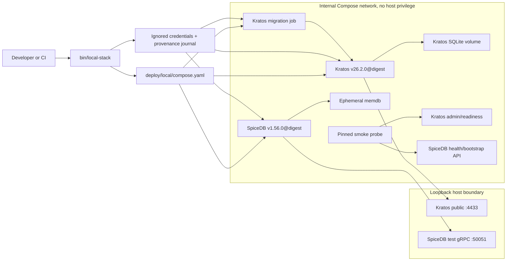
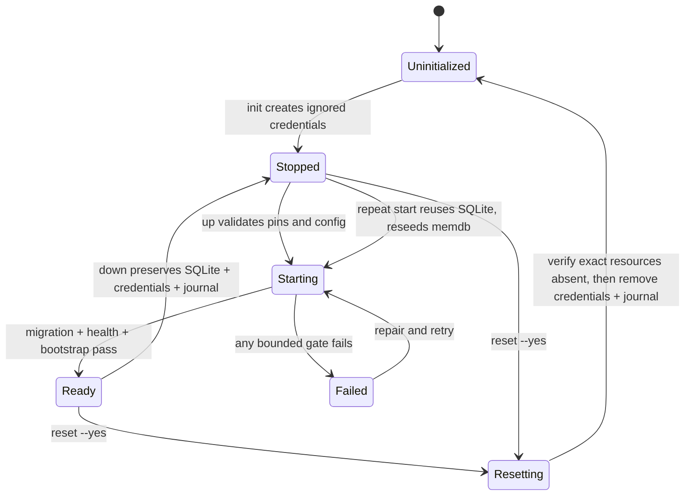

# Pinned Local Development Environment - Milestone 2 Plan

## Goal Capsule

- **Objective:** Provide a repeatable, locally isolated Docker Compose profile that starts immutably pinned Ory Kratos and SpiceDB releases, proves their configured behavior with executable positive and negative evidence, and gives later milestones a dependable integration target.
- **Product provenance:** The local handoff's Milestone 2 decomposition, the repository strategy, accepted ADRs, ownership map, dependency policy, testing strategy, threat-modeling process, secrets policy, and the approved global realm data-residency Product Contract. The handoff remains local-only; repository-native authorities and this plan own implementation behavior.
- **Scope boundary:** This milestone creates only the local/test component environment. It does not create the Elixir control plane, a consuming application, a canonical identity model, a shared SpiceDB schema, an authorization client, production persistence, or production deployment packaging.
- **Execution profile:** Linux containers on a developer workstation and a Linux CI runner. Docker Compose is a local/test orchestration choice, not a production architecture decision.
- **Stop conditions:** Stop if an OCI digest cannot be verified against its readable release tag, the chosen image lacks an intended architecture, a required credential would need to be tracked or printed, Kratos admin access would be exposed beyond the internal network, a reset cannot be scoped to this profile's exact resources, or the plan would need to decide a later product or production boundary.
- **Tail ownership:** Implement and verify locally only after maintainer approval. Committing, pushing, and opening a later pull request remain separate actions unless explicitly requested.
- **Open blockers:** None. The planning-owned recommendations below become approved only when the maintainer approves this plan; later product and production questions remain explicitly deferred.

---

## Product Contract

### Summary

Milestone 2 turns the documentation-only repository into an executable local component fixture. A maintainer can initialize local-only secrets, start Kratos and SpiceDB in dependency order, wait for real readiness, run deterministic component-native smoke checks, inspect sanitized status, stop without losing intended state, and deliberately reset only this profile. The exact component identities and observed results are retained as a narrowly scoped compatibility record.

### Problem Frame

Later identity and authorization work cannot be reviewed honestly against floating image tags, copied upstream quickstarts, or services that are only assumed to be ready. The repository also cannot choose a production database, production packaging, public control-plane API, or canonical identity and authorization model merely to make a local environment convenient.

The smallest useful next milestone is therefore an intentionally non-production profile around real pinned upstream components. It must be safer than the upstream demo defaults: secrets are generated and ignored, privileged endpoints stay internal, host exposure is loopback-only, logs do not leak sensitive values, persistent Kratos state is paired with its encryption material, and destructive reset is explicit and narrowly targeted.

### Actors

- **Maintainer/developer:** initializes, starts, inspects, tests, stops, and resets the local profile.
- **CI runner:** exercises the same non-interactive fresh-start and smoke contract on Linux without receiving repository or production secrets.
- **Kratos:** owns the disposable local identity state and its SQLite schema migrations.
- **SpiceDB:** owns the disposable local authorization state in an in-memory datastore.
- **Later control-plane and application implementers:** may use the profile as an evidence/research target, but must explicitly select their own ports, protocols, and contracts in future milestones.

### Key Decisions Proposed for Approval

- **Docker Compose for local/test orchestration only.** It is the narrowest common tool that expresses migration jobs, health-gated startup, named volumes, internal networks, and exact image identities. Production packaging remains open.
- **Docker Compose plugin `2.35.0` as the syntax/behavior floor.** This is the first release containing `config --no-env-resolution`, which lets the wrapper validate the model without printing or expanding the generated `env_file`; the exact tested Docker/Compose tuple still bounds every support claim.
- **Kratos `v26.2.0`, SpiceDB `v1.56.0`, and `curlimages/curl` `8.21.0` as the first candidate tuple.** The upstream services are current OSS releases at the research cutoff, and the probe is a current official curl image. Implementation records registry-specific OCI index digests instead of trusting mutable tags.
- **Persistent SQLite for Kratos and memdb for SpiceDB.** These match upstream local/test guidance and avoid selecting a production datastore topology. The recommended persistent Kratos path proves migration/restart behavior and gives Milestone 3 a stable developer target, at the cost of the paired credential, lock, journal, and safe-reset machinery in this plan. A fully disposable two-service fixture is the lower-complexity alternative; approving this plan chooses persistence for Kratos while SpiceDB remains deliberately rebuilt after each process start.
- **A repository-owned operator wrapper.** `bin/local-stack` provides a stable `init`, `up`, `status`, `smoke`, `down`, and confirmed `reset` interface so callers do not reproduce orchestration ordering or resource targeting manually.
- **Loopback integration surfaces for later local clients.** Publish Kratos public HTTP and authenticated SpiceDB gRPC only on the attested daemon host's loopback so Milestones 3-4 can evaluate the fixture from a host-run client; keep every privileged/bootstrap endpoint internal and make no future port/protocol promise. An internal-only profile has less surface but is not directly usable as the handoff's later integration target; approving this plan chooses loopback publication for these two data-plane surfaces.
- **Generated credentials, never public demo secrets.** Kratos cookie, cipher, and pagination secrets plus the SpiceDB preshared key live in one exact ignored local file, are never echoed, survive ordinary stop/start, and are destroyed together with the Kratos volume on reset.
- **Functional smoke evidence, not health-only evidence.** Test-owned fixtures prove a disposable Kratos identity can be written/read and survives restart; a noncanonical SpiceDB schema and relationship prove one allow and one deny. These fixtures do not settle Milestones 3-4 contracts.
- **Minimal GitHub Actions evidence.** The recommendation selects the repository's first CI provider so the compatibility result is repeatable beyond one workstation. A least-privilege workflow runs the same fresh-start smoke gate on pull requests, pins actions by immutable commit SHA, and receives no repository or production secret. The lower-commitment alternative is to keep the interface CI-compatible but make only a workstation-scoped claim; approving this plan selects GitHub Actions now.

### Requirements

**Scope and artifact identity**

- R1. Create one explicitly local/test profile containing unmodified Kratos and SpiceDB services, a Kratos migration job, and only the auxiliary probe/bootstrap tooling required for executable evidence; do not add Elixir, Phoenix, Hydra, Oathkeeper, Keto, a consuming application, or a production datastore.
- R2. Pin Kratos `v26.2.0`, SpiceDB `v1.56.0`, and every auxiliary runtime image as readable `tag@sha256:<registry-specific-OCI-index-digest>` references. Record the selected platform child digest as well as the index, allowlisted registry and publisher, available signature/provenance/SBOM evidence or an explicit unavailable-evidence disposition, supported architectures, release and advisory review, license obligations, owner, and verification date.
- R3. Require the `docker compose` plugin with a `2.35.0` syntax/behavior floor for long-form health/dependency semantics and `config --no-env-resolution`. Record the exact Docker Engine/Desktop, Compose, host OS, and architecture used for every compatibility result; do not infer support for untested host tuples.

**Secrets, isolation, and state**

- R4. Add `deploy/local/.local-stack-credentials.env`, `deploy/local/.local-stack-credentials.tmp.*`, `deploy/local/.local-stack-state.json`, `deploy/local/.local-stack-state.tmp.*`, and the `deploy/local/.local-stack.lock/` directory to Git exclusion before generation; do not use Compose's automatically loaded `.env` path. Initialization uses the host's cryptographic random source, the credential contract below, atomic exclusive file creation, restrictive permissions where supported, no terminal echo, no overwrite, and distinct values per purpose. Reject symlinks, FIFOs, devices, non-regular files, shell tracing, sourcing/evaluation, environment dumps, and any diagnostics path that would render resolved secrets.
- R5. Require `bin/local-stack` to attest a supported local Docker daemon/context and reject remote contexts plus ambient Compose project/file/env/profile/platform overrides before any pull or mutation. Bind the Kratos public API and SpiceDB test-access endpoint only to the evaluated daemon's `127.0.0.1`; keep the Kratos admin API, component health endpoints used by orchestration, and any SpiceDB HTTP bootstrap endpoint on the internal Compose network with no host-published port. Prove those privileged endpoints are unreachable from an unprivileged non-member container, while documenting that trusted Docker host/daemon users can inspect containers or join their networks and are therefore inside this local trust boundary. Disable wildcard CORS, sensitive-value logging, and upstream telemetry where supported. Give containers no Docker socket, privileged mode, host namespace/device access, writable repository mount, or unnecessary Linux capability. Kratos self-service login, registration, recovery, verification, and settings behavior is outside Milestone 2: retain only neutral configuration required for the pinned component to start, and do not add method/flow-specific overrides, assertions, or capability claims merely to constrain endpoints that no Milestone 2 consumer uses.
- R6. Persist Kratos SQLite state in one per-checkout project-scoped named volume with `deploy/local/.local-stack-state.json` tied to the canonical checkout, configuration identity, component digest, and non-secret state generation. Ordinary `down` preserves the volume, `deploy/local/.local-stack-credentials.env`, and the journal. Confirmed `reset` removes only journal-attested profile containers/networks and volume, then deletes both exact regular local files after all old resources are verified absent, so encrypted state and its cipher material cannot become separated or collide with another checkout.
- R7. Run SpiceDB with memdb and document that its state disappears whenever its process is recreated. Bootstrap the test-only schema and relationship fixtures idempotently after each start; do not place them under `schemas/spicedb/` or present them as canonical authorization conventions.

**Startup, behavior, and failure**

- R8. Make startup dependency-aware and bounded: validate prerequisites, local-context ownership, credentials, state provenance, and configuration; resolve/pull pinned artifacts; obtain exclusive SQLite ownership; complete and attest the Kratos migration for the current image/configuration/state generation; reach Kratos readiness; reach SpiceDB health; complete and attest the deterministic SpiceDB bootstrap for the current process and fixture hash; and only then report aggregate readiness. Never auto-delete state after a migration or bootstrap failure.
- R9. Give every operator action a stable exit contract. Missing prerequisites, missing or unsafe credentials, port collisions, digest or architecture mismatch, invalid configuration, failed migration, readiness timeout, bootstrap failure, partial readiness, or failed smoke assertion returns nonzero and identifies the failed stage without exposing credentials or sensitive responses.
- R10. Exercise Kratos through a test-owned `.invalid` identity fixture: load the configured identity schema, create/read the disposable identity through the internal admin boundary, prove it survives a service restart, and prove an invalid public session is rejected. Do not implement a successful application session or control-plane identity context.
- R11. Exercise SpiceDB through a test-owned noncanonical schema and opaque fixture IDs: authenticate, write schema and one relationship, prove one explicit permission allow and one explicit deny, and prove omitted and wrong preshared keys are rejected. Reconcile and verify the exact declared schema/relationship set after each bootstrap; a partially failed bootstrap requires memdb recreation or full reconciliation before readiness. Do not select the later application client protocol or shared schema conventions.
- R12. Prove failure and recovery behavior with disposable overrides: a Kratos migration/configuration failure prevents Kratos and aggregate readiness; invalid SpiceDB bootstrap data prevents aggregate readiness; stopping either component makes aggregate status and its smoke checks fail promptly while sanitized diagnostics identify the affected service.
- R13. Make `reset` a deliberate, retry-safe destructive state machine: acquire the lifecycle lock; verify the canonical checkout, journal, Compose ownership labels, exact expected resources, attachments, and both local-file types; require explicit confirmation; and atomically journal `normal`, `resetting`, or `blocked` phase plus the exact remaining resources in `deploy/local/.local-stack-state.json` before each destructive transition. Stop/remove containers before the volume, verify old resources are absent before deleting `deploy/local/.local-stack-credentials.env`, and delete the journal last. Every lifecycle command validates the journal phase; interruption preserves the journal, reports exact remaining work, blocks `up`, and lets a later confirmed `reset` resume. Demonstrate that a completed reset starts with new credentials, empty Kratos state, and only declared SpiceDB fixtures. Reject broad targets, label-only matching, unresolved variables, or extra/ambiguous resources.

**Evidence, automation, and documentation**

- R14. Maintain a dependency inventory and one compatibility-ledger entry labeled **local component-fixture compatibility** for the exact evaluated profile. Evidence names the tested implementation revision (not the later ledger-only commit), immutable workflow run, workflow identity and reviewer provenance, image index/platform digests, config/fixture content hashes, host tuple, positive and negative scenarios, failed/skipped gates, date, owner, advisory/license review, and durable CI or local output location. A later evidence-only commit may record that result without claiming its own untested revision; any runtime/configuration content-hash change requires a new run. The result is supported only for the named scope and tuple; it is not authentication-ready, authorization-ready, production-security, or cross-platform evidence, and everything else is unknown.
- R15. Add one GitHub-hosted ephemeral-runner `pull_request` workflow, never `pull_request_target` or a self-hosted runner, with explicit read-only permissions, no OIDC/package/write scopes, checkout credentials disabled, every action pinned by commit SHA, no repository/production secrets, ephemeral local credentials, the same fresh-start/smoke/reset contract, no cache/artifact containing raw service output, and guaranteed profile-scoped cleanup. A contributor-authored PR run is review evidence, not self-attestation; support requires a reviewed commit/workflow identity and reviewer provenance.
- R16. Create and complete a scoped threat model for the Docker daemon/context, daemon-host loopback, Compose internal network, privileged probe/admin APIs, credential file and injection path, SQLite volume, memdb lifecycle, logs/evidence, first-run registry access and image provenance, untrusted PR code/CI runner, and destructive reset behavior before calling the profile complete.
- R17. Document the actual operator commands and prerequisites in one runbook; update root navigation, `AGENTS.md`, strategy, repository ownership, dependency/testing policies, and definition of done only where the executable toolchain makes earlier statements stale.
- R18. Preserve later decisions as deferrals: production database topology, production packaging/GCP shape, public control-plane API style, Elixir/OTP versions, administrative interface, canonical SpiceDB schema and client protocol, residency-domain profile implementations, privacy retention, audit storage/export, and aggregate release policy. Preserve the approved stack-versus-consumer residency responsibility split without implementing it in this milestone.
- R19. Serialize every lifecycle mutation through one per-checkout `mkdir`-based `deploy/local/.local-stack.lock/` directory and bind credentials, Kratos volume, completed migration, SpiceDB bootstrap, and status/reset operations to the same non-secret state generation and configuration identity. The lock records canonical checkout/config identity, generation, PID, process-start fingerprint, acquisition time, and a random ownership token; traps remove it only when the token still matches. A later command may clear only a provably stale lock after revalidating its exact regular contents and absent/mismatched process fingerprint; uncertainty or an active owner fails closed with recovery instructions. Refuse concurrent mutation or any missing/mismatched provenance before changing state. Normal reset requires an intact validated journal. A missing/corrupt journal or unrecoverable canonical-path mismatch is a stop condition: no automated deletion occurs, and the runbook's exceptional manual recovery requires read-only discovery, exact-name/label/attachment verification, per-resource preview, and deliberate confirmation. Normal recovery is a confirmed reset or a separately approved migration path, never silent secret regeneration or stale completion reuse.

### Local Credential Contract

| Purpose | Generated format | Minimum strength and validation |
| --- | --- | --- |
| Kratos cipher secret | Exactly 32 safe printable ASCII characters accepted by the pinned `v26.2.0` cipher configuration | At least 160 bits of cryptographic entropy; verify the pinned image accepts the exact length before state creation. |
| Kratos cookie secret | Unpadded base64url encoding of 32 random bytes | 256 source bits; reject padding, whitespace, wrong length, or equality with another generated value. |
| Kratos pagination secret | Unpadded base64url encoding of 32 random bytes | 256 source bits; required by the pinned advisory disposition; reject padding, whitespace, wrong length, or equality with another generated value. |
| SpiceDB preshared key | Unpadded base64url encoding of 32 random bytes | 256 source bits; reject padding, whitespace, wrong length, or equality with another generated value. |

All values are generated independently in one exclusive initialization, validated before any state is created, injected without appearing in the tracked/effective model, and tested for format, uniqueness, undersized-value rejection, and non-disclosure.

### Local Lifecycle Budgets

| Stage | Default maximum |
| --- | --- |
| Prerequisite, context, model, or `status` check | 10 seconds per check |
| Pinned image acquisition | 300 seconds total |
| Kratos migration | 90 seconds |
| Kratos readiness | 60 seconds |
| SpiceDB health | 60 seconds |
| SpiceDB fixture bootstrap | 45 seconds |
| Full component smoke | 180 seconds |
| `down` | 60 seconds |
| Confirmed `reset` | 120 seconds |
| Aggregate `up`, including acquisition | 600 seconds |

Poll at one-second intervals and stop at the first expired stage with a sanitized, stage-specific nonzero result. These are candidate supported defaults, not silent environment-controlled values. Before implementation completion, retain per-stage timings from at least three clean cold-start/smoke runs on each claimed tuple; each limit must be at least twice the slowest observed non-network stage, while image acquisition remains a bounded operator choice rather than a performance guarantee. If the evidence does not fit, amend the visible defaults before approving the compatibility record rather than silently overriding them. Any later change is an explicit wrapper/configuration change that must be documented and re-evidenced.

### Key Flows

- F1. **Fresh initialize and start:** prerequisite check -> secure local credential creation -> configuration validation -> immutable image acquisition -> Kratos migration -> component health gates -> SpiceDB test bootstrap -> aggregate ready.
- F2. **Repeat start:** reuse credentials and Kratos volume -> idempotent migration -> preserve Kratos fixture state -> recreate and deterministically bootstrap SpiceDB memdb -> aggregate ready without duplicate fixtures.
- F3. **Inspect and smoke:** report each component separately -> verify exact versions/digests -> exercise Kratos persistence and rejection -> exercise SpiceDB allow/deny and wrong-key rejection -> return one sanitized result.
- F4. **Stop and resume:** stop containers while preserving `deploy/local/.local-stack-credentials.env`, `deploy/local/.local-stack-state.json`, and the Kratos volume -> start again -> recover readiness -> rebuild only ephemeral SpiceDB state.
- F5. **Confirmed reset:** preview exact resources -> require confirmation -> remove journal-attested resources -> verify them absent -> remove both local files -> reinitialize with new secrets -> verify the prior Kratos identity is absent and the old SpiceDB key is rejected, while only declared SpiceDB fixtures exist in the new memdb process.
- F6. **Failure and recovery:** inject one disposable invalid configuration or stop one component -> aggregate status fails nonzero -> unaffected component remains independently observable -> restore valid configuration/service -> readiness and smoke recover.

### Acceptance Examples

- AE1. **Covers R1-R3.** Given a clean checkout with a supported Compose plugin, when the local profile is inspected before start, then every runtime image is a readable tag paired with an OCI digest, no floating tag is present, and no excluded component or production database appears.
- AE2. **Covers R4, R6, R19.** Given no local state exists, when initialization runs, then it atomically creates distinct random values and a paired provenance journal at exact ignored regular-file paths with restrictive permissions, prints none of them, and a second or concurrent initialization refuses to overwrite or race them. Symlink, FIFO, and mismatched-journal paths cause no write.
- AE3. **Covers R5, R16.** Given the profile is ready on an attested local Docker context, when host bindings, privileges, mounts, and the internal network are inspected, then only the documented smoke/test surfaces have daemon-host loopback publications; privileged endpoints have no host-published port and are unreachable from an unprivileged non-member container. The evidence explicitly treats trusted Docker host/daemon users as able to inspect or join the profile network. A remote Docker context or hostile ambient Compose override causes no pull, start, mutation, or deletion.
- AE4. **Covers R8-R9.** Given Kratos migration fails or a component never becomes ready, when `up` reaches its bounded wait, then aggregate readiness is nonzero, the failed stage is named, SpiceDB bootstrap is not misreported as complete, and diagnostics reveal no credential.
- AE5. **Covers R10.** Given a ready Kratos service, when the smoke fixture is created and Kratos is restarted, then that fixture can still be read from SQLite, while an invalid session request is rejected and no real personal data is used.
- AE6. **Covers R7, R11, R19.** Given a fresh SpiceDB process, when bootstrap and smoke run, then the exact test-owned schema/relationship set is attested to that process and fixture hash, one opaque fixture check allows, a sibling check denies, omitted and wrong keys are rejected, and recreation restores only declared fixtures without accepting stale bootstrap evidence.
- AE7. **Covers R6, R13, R19.** Given the local profile contains a reset-only Kratos identity, when ordinary `down` and `up` run, then the identity and credentials survive while SpiceDB rebuilds exactly its declared fixtures; when confirmed reset runs, then only journal-attested resources are removed, the old identity is absent after reinitialization, new credentials work, and the old SpiceDB key is rejected. Interrupted reset retains the journal, retains credentials until all Docker resources are verified absent, blocks `up`, reports exact remaining work, and can safely finish from the validated empty `resetting` journal if credentials were already removed.
- AE8. **Covers R12.** Given one component is stopped, when status and smoke run, then both identify partial readiness and return nonzero without claiming application-level fail-closed behavior that this milestone does not implement.
- AE9. **Covers R14-R15.** Given local and CI verification complete, when a reviewer opens the compatibility record, then it names the reviewed revision/workflow, exact index and platform artifacts, config/fixture and host tuple, observed scenarios, failures/skips, reviewer provenance, evidence location, and **local component-fixture compatibility** result without storing tokens, cookies, raw identities, or production data. A PR-authored run alone cannot self-certify support.
- AE10. **Covers R17-R18.** Given a future planner starts Milestone 3 or 4, when they follow repository navigation, then they can use the pinned profile as an evidence target while explicitly deciding whether to adopt or replace its local test ports/protocols; the public control-plane API, canonical identity/profile model, SpiceDB schema conventions, application client protocol, and production topology remain visibly undecided.

### Success Criteria

- A new maintainer can initialize, start, verify, stop, resume, and deliberately reset the local profile through one documented repository interface.
- Kratos and SpiceDB become ready only after their real prerequisites complete, and executable smoke evidence covers positive, negative, restart, partial-failure, and reset behavior.
- Every runtime artifact and CI action is immutably identified with reviewed provenance; support claims name only the exact evaluated local component-fixture profile and host tuples.
- Tracked content, logs, evidence, and CI artifacts contain no local credentials, session material, or real personal data.
- Later application, product-data, API, authorization-client, production-database, and production-deployment decisions remain open.

### Scope Boundaries

Milestone 2 excludes:

- The Elixir/Phoenix control plane, Mix project, shared Elixir packages, or any application-facing API.
- A successful Kratos application session, identity-context propagation, consuming application, or product UI.
- Kratos self-service login, registration, recovery, verification, and settings flow design or disablement; those behaviors are decided and tested with the authentication integration milestone that consumes them.
- A canonical identity schema or a decision about globally shared versus application-owned profile attributes; the local schema is a disposable integration fixture.
- Canonical SpiceDB namespaces, relationship naming, consistency semantics, caveats, generated clients, or protected-operation enforcement; the local schema is a nonnormative smoke fixture.
- Relationship-mutation ownership beyond test bootstrap, application-side fail-closed behavior, organizations, invitations, administration, audit, or privacy workflows.
- PostgreSQL, CockroachDB, MySQL, HA, backups, production migration guarantees, or any production support claim.
- Production residency-domain profiles, jurisdiction mappings, relocation, or regulatory compliance claims; the approved responsibility boundary remains owned by the separate Product Contract.
- Terraform, Helm, Kubernetes, GCP, ingress, TLS termination, WAF, workload identity, production secret storage, or production packaging.
- Hydra, Oathkeeper, Keto, an upstream fork, vendored source, or a generalized plugin/framework layer.
- A broad offline guarantee, arbitrary port customization, parallel local realms, Windows container support, or support for untested host/runtime/architecture tuples.

### Dependencies and Assumptions

- First initialization requires network access to the selected container registries; subsequent offline behavior is not a support claim.
- The first claimed container architectures are Linux `amd64` in CI and Linux `arm64` on the maintainer's Apple Silicon workstation, only after the resolved OCI index, selected platform-child digests, and observed reviewed runs prove both.
- Docker Compose plugin `2.35.0` is the syntax/behavior floor. Exact Docker Engine/Desktop and Compose versions remain part of each evidence tuple instead of implying that every newer combination is supported.
- The host provides a cryptographically secure random source and basic POSIX tooling used by `bin/local-stack`; the wrapper detects missing prerequisites before writing state.
- Test identities use reserved `.invalid` addresses, opaque non-user identifiers, and runtime-generated credentials. They are disposable and never evidence for a product identity model.
- The implementation confirms Kratos `v26.2.0` migration subcommands from the pinned image; it does not copy stale pre-`v25.4` migration examples.

### Outstanding Questions

#### Proposed for Approval with This Plan

- Use Docker Compose as the local/test packaging mechanism while leaving production packaging open.
- Require Compose plugin `2.35.0` as the first local-profile feature floor while supporting only exact observed Docker/Compose tuples.
- Pin Kratos `v26.2.0`, SpiceDB `v1.56.0`, and `curlimages/curl` `8.21.0` at their resolved OCI digests.
- Use persistent SQLite for local Kratos and ephemeral memdb for local SpiceDB, accepting the credential/journal/reset machinery instead of a fully disposable fixture.
- Add `bin/local-stack` as the supported operator interface, with the stated lifecycle budgets and guarded state semantics.
- Publish only Kratos public HTTP and authenticated SpiceDB gRPC on the attested daemon-host loopback as local integration surfaces; keep all privileged/bootstrap endpoints unpublished and leave later port/protocol adoption open.
- Select GitHub Actions as the first automated evidence runner instead of limiting Milestone 2 evidence to the maintainer workstation.
- Treat the test identity and SpiceDB schemas as integration fixtures, not canonical contracts.

#### Deferred to Later Milestones

- Production database technology, topology, credential isolation, backup, restore, and HA.
- Production packaging, GCP reference architecture, ingress, TLS, workload identity, and secret backend.
- Elixir, OTP, Phoenix, shared-package, and application-client versions.
- Public control-plane contract style and service-to-service authentication.
- Canonical shared identity/profile attributes and Kratos lifecycle contract.
- Canonical SpiceDB schema, consistency behavior, authorization client protocol, relationship mutation ownership, and protected-operation tests.
- Administration, exact residency-domain and jurisdiction profiles, privacy retention, audit integrity/storage/export, and aggregate release/versioning policy. The stack-versus-consumer residency responsibility split itself is already settled by the global realm data-residency Product Contract.

### Sources

**Repository authorities**

- `STRATEGY.md` - accepted project direction, current track, non-goals, and open decisions.
- `docs/architecture/repository-layout.md` - target ownership and creation rules.
- `docs/architecture/decisions/0002-kratos-identity-lifecycle.md` - Kratos ownership boundary.
- `docs/architecture/decisions/0003-spicedb-application-authorization.md` - SpiceDB and application enforcement boundary.
- `docs/architecture/decisions/0007-upstream-upgrade-independence.md` - unmodified, separately deployable upstream components.
- `docs/policies/dependency-management.md` - immutable artifact inventory and compatibility ledger.
- `docs/policies/testing-strategy.md` - real-component, negative, migration, and evidence expectations.
- `docs/policies/secrets-handling.md` - tracked-content and credential-lifecycle constraints.
- `docs/security/threat-modeling.md` - scoped review triggers and required model content.
- `docs/project/definition-of-done.md` - repository-wide completion gates.
- `docs/plans/2026-08-14-1804-feat-global-realm-data-residency-plan.md` - approved realm-level residency and stack-versus-consumer responsibility boundary; production implementation remains outside Milestone 2.

**Primary external sources, researched 2026-08-14**

- [Kratos `v26.2.0` release](https://github.com/ory/kratos/releases/tag/v26.2.0) and [release-pinned quickstart configuration](https://github.com/ory/kratos/blob/v26.2.0/contrib/quickstart/kratos/email-password/kratos.yml) - current OSS version and configuration surface; the quickstart's fixed secrets, permissive CORS, and sensitive logging are explicitly not copied.
- [Ory Kratos `v25.4` migration and versioning announcement](https://www.ory.com/blog/new-ory-kratos-v-25-4-0-open-source-launch-passwordless-sms-login-android-webauthn-passkeys) - current migration command family and CalVer transition.
- [Kratos security advisory GHSA-hgx2-28f8-6g2r](https://github.com/ory/kratos/security/advisories/GHSA-hgx2-28f8-6g2r) - pagination-secret requirement and patched-release context.
- [SpiceDB `v1.56.0` release](https://github.com/authzed/spicedb/releases/tag/v1.56.0), [datastore guidance](https://authzed.com/docs/spicedb/concepts/datastores), and [testing guidance](https://authzed.com/docs/spicedb/modeling/validation-testing-debugging) - current version, memdb limits, and test-server distinction.
- [SpiceDB security advisories](https://github.com/authzed/spicedb/security/advisories) - release selection and implementation-time advisory recheck.
- [Official curl container image](https://hub.docker.com/r/curlimages/curl) - current probe-image tag and supported container platforms.
- [Docker Compose startup ordering](https://docs.docker.com/compose/how-tos/startup-order/), [service reference](https://docs.docker.com/reference/compose-file/services/), [`config` reference](https://docs.docker.com/reference/cli/docker/compose/config/), [`--no-env-resolution` introduction](https://github.com/docker/compose/commit/a0d1c3f944d9fde6ce694b9ec137ca1d6737afd3), [`v2.35.0` release](https://github.com/docker/compose/releases/tag/v2.35.0), and [image trust model](https://docs.docker.com/compose/trust-model/) - health-gated dependencies, the first release with `--no-env-resolution`, secret-safe quiet model validation, and immutable image identity.
- [Docker Compose `down` reference](https://docs.docker.com/reference/cli/docker/compose/down/) - project-scoped volume and orphan cleanup semantics used by confirmed reset.

---

## Planning Contract

### Product Contract Preservation

This plan follows the handoff's explicit Milestone 2 decomposition: a pinned local Kratos and SpiceDB environment. The earlier, broader walking-skeleton idea was rejected because it would silently pull the Kratos-authenticated control plane and application authorization client from Milestones 3-4 into this slice. R1 and R18 keep that correction enforceable.

### Planning Assumptions

- Approval of this plan approves only the decisions under **Proposed for Approval with This Plan**. It does not approve any later-milestone deferral.
- The local profile is allowed to use development-only plaintext transport only after the wrapper attests a supported local Docker daemon/context, confirms the evaluated daemon-host bindings are loopback-only, and keeps privileged endpoints internal; the scoped threat model must validate this assumption and name its invalidation triggers.
- Functional fixtures may exercise upstream APIs without becoming product contracts. Their paths, names, and documentation must state `local-smoke` or equivalent nonnormative ownership.
- A CI workflow is in scope because compatibility evidence otherwise remains workstation-only. It must not turn a passing `amd64` run into an unsupported cross-platform claim.

### Key Technical Decisions

- KTD1. **Record Docker Compose as a local-profile decision in ADR 0008.** Choose Compose over Kubernetes, Helm, or a bespoke process supervisor because the milestone needs a small workstation/CI composition with jobs, health gates, volumes, and networks. The ADR explicitly leaves production packaging open and has a low reversal cost. Covers R1, R3, R18.
- KTD2. **Use current readable releases plus registry-specific OCI digests and reviewed provenance.** Start with Kratos `v26.2.0`, SpiceDB `v1.56.0`, and `curlimages/curl` `8.21.0`; allowlist their official registry/publisher, resolve each multi-platform index and selected platform-child digest, inspect `amd64`/`arm64` membership, and record available signature/provenance/SBOM evidence or its explicit absence. A release asset checksum or digest alone cannot establish container provenance. Covers R2, R14, R16.
- KTD3. **Define a Compose feature floor, not an unearned broad runtime guarantee.** `2.35.0` is the minimum plugin behavior used by the profile because it includes both the required dependency semantics and `config --no-env-resolution`. Each compatibility record names the exact Docker and Compose tuple observed; newer or different hosts remain unknown until tested. Covers R3, R14.
- KTD4. **Use local-only storage with intentionally different lifecycles.** Kratos gets file-backed SQLite in a named volume so migrations and restart persistence are observable. SpiceDB gets memdb so no production datastore is implied; its smoke state is rebuilt deterministically. Covers R6-R8, R18.
- KTD5. **Generate credentials without treating Compose diagnostics as a secret boundary.** `deploy/local/.local-stack-credentials.env` owns distinct Kratos cookie/cipher/pagination and SpiceDB values, while `deploy/local/.local-stack-state.json` owns non-secret provenance and reset-journal state. Initialization uses exclusive regular-file creation and never sources/evaluates the file, enables shell tracing, retains resolved configuration, or prints raw upstream output. Validate the model with `docker compose config --quiet --no-env-resolution` and inspect only non-secret selectors such as images/services; never run or retain plain resolved `docker compose config` output after credentials exist. Where Docker inspection necessarily reveals injected environment, local Docker-daemon users are a trusted residual risk with a threat-model invalidation trigger. Covers R4, R6, R14-R16, R19.
- KTD6. **Expose only local smoke/test surfaces on an attested daemon loopback.** The recommended integration-target shape publishes Kratos public HTTP and authenticated SpiceDB gRPC on the evaluated local daemon host's `127.0.0.1`; keep Kratos admin, readiness, and bootstrap-only HTTP internal with no host-published port. Prove publication state and unprivileged non-member-container isolation, not unreachability from trusted Docker host/daemon users. These ports/protocols carry no Milestones 3-4 compatibility promise. Reject remote Docker contexts and ambient Compose graph overrides; plaintext and `--dev` behavior are acceptable only inside the validated local boundary. Covers R5, R16, R18.
- KTD7. **Make readiness an attested dependency graph.** The current state generation exclusively owns SQLite while the current Kratos digest/config runs migration; Kratos `/health/ready` must pass before identity smoke; the current SpiceDB process must pass health before `bin/local-stack` bootstraps and reconciles the exact current fixture hash; bootstrap must complete before aggregate readiness. Short-form ordering, arbitrary sleeps, stale completed jobs, and stale process evidence are rejected. Covers R8-R9, R11-R12, R19.
- KTD8. **Use one context-bound, serialized operator wrapper.** `bin/local-stack` owns local-daemon attestation, ambient-override rejection, per-checkout project/config identity, the portable token-checked `mkdir` lock defined in R19, the numeric lifecycle budgets above, sanitized diagnostics, idempotent SpiceDB bootstrap, and journal-attested reset targeting. Raw Compose remains inspectable but is not the supported lifecycle interface. This avoids a new task-runner dependency while preventing concurrent or cross-checkout mutation. Covers R3-R6, R8-R9, R13, R17, R19.
- KTD9. **Use test-owned functional fixtures without settling product contracts.** Kratos smoke uses an internal admin boundary only to prove local-smoke schema load and SQLite persistence, plus invalid-session rejection. SpiceDB smoke uses an internal bootstrap path to prove narrow component semantics. Its result is only **local component-fixture compatibility**—not authentication readiness, authorization readiness, protected-operation fail-closed behavior, CORS/CSRF security, or a later client/port contract. Covers R7, R10-R12, R14, R18.
- KTD10. **Retain reviewed evidence in repository-native dependency records and least-privilege CI.** `docs/dependencies/` owns the inventory and compatibility ledger; a GitHub-hosted ephemeral `pull_request` workflow runs the same wrapper with no persisted checkout credentials, secrets, write/OIDC/package permission, or raw-output artifact. Contributor-authored CI is evidence for review but cannot self-certify support; the ledger binds the tested implementation revision and immutable workflow run to reviewer provenance, while a later ledger-only commit records rather than reclaims that result. Covers R14-R15, R17.
- KTD11. **Bind all state transitions to one generation and recover explicitly.** Credentials, the atomically replaced versioned state/reset journal, Compose resources, Kratos volume, migration attestation, SpiceDB process/bootstrap attestation, and lifecycle lock share one per-checkout generation/configuration identity. Missing or mismatched provenance, concurrent mutation, interrupted migration, or a journal in `resetting`/`blocked` phase blocks `up`; confirmed reset resumes only from an intact journal's exact remaining-resource set, preserving credentials until all old resources are verified absent. A missing/corrupt journal or unrecoverable checkout-path mismatch never falls back to label-only automation; it enters the reviewed manual-recovery stop path in R19. A separately approved migration path is the only nondestructive alternative. Covers R6, R8, R13, R19.

### High-Level Technical Design

The diagram shows ownership and trust boundaries, not exact Compose syntax.



Lifecycle behavior is deliberately asymmetric:



Aggregate readiness follows this non-prescriptive sequence:

```text
attest local Docker context, reject ambient overrides, acquire lifecycle lock
  -> validate prerequisites, credential/journal safety, and state generation
  -> validate fully resolved Compose model and immutable images
  -> complete Kratos migration with exclusive SQLite ownership and current attestation
  -> require Kratos datastore-aware readiness
  -> require SpiceDB gRPC health
  -> reconcile only test-owned SpiceDB fixtures for the current process/hash
  -> run component-native smoke checks
  -> emit a sanitized tuple/result summary
```

### Output Structure

```text
.
├── .github/
│   └── workflows/
│       └── local-stack.yml
├── .gitignore
├── AGENTS.md
├── README.md
├── STRATEGY.md
├── bin/
│   └── local-stack
├── config/
│   └── upstream/
│       └── kratos/
│           └── local/
│               └── kratos.yaml
├── deploy/
│   └── local/
│       ├── .env.example
│       ├── .local-stack-credentials.env  # generated, ignored
│       ├── .local-stack-state.json       # generated, ignored
│       ├── .local-stack.lock/            # generated, ignored while held
│       └── compose.yaml
├── docs/
│   ├── architecture/
│   │   ├── README.md
│   │   ├── repository-layout.md
│   │   └── decisions/
│   │       └── 0008-docker-compose-local-development-profile.md
│   ├── dependencies/
│   │   ├── README.md
│   │   ├── upstream-components.md
│   │   └── compatibility/
│   │       └── local-development.md
│   ├── policies/
│   │   ├── dependency-management.md
│   │   └── testing-strategy.md
│   ├── project/
│   │   └── definition-of-done.md
│   ├── runbooks/
│   │   └── local-development.md
│   └── security/
│       └── local-development-environment-threat-model.md
└── tests/
    └── integration/
        └── local_stack/
            ├── smoke.sh
            └── fixtures/
                ├── kratos/
                │   ├── identity.json
                │   └── local-smoke.identity.schema.json
                └── spicedb/
                    ├── check-allow.json
                    ├── check-deny.json
                    ├── relationship.json
                    ├── schema.json
                    └── schema.zed
```

No `apps/`, `packages/elixir/`, `schemas/spicedb/`, production deployment, or optional-component path is created by this milestone.

### System-Wide Impact

- **Repository entry points:** `README.md` and `AGENTS.md` gain the first executable project workflow. Earlier text that says no runtime command exists must be replaced only for the new local profile; no Elixir/test commands are invented.
- **Dependency boundary:** Kratos, SpiceDB, and the probe become real repository dependencies. Their index and selected-platform identities, publisher/provenance evidence, configuration profile, advisories, licenses, and evidence must enter the inventory and update process.
- **Security boundary:** The change introduces local credentials, privileged upstream APIs, a persistent identity volume, registry pulls, a trusted local Docker daemon, plaintext daemon-loopback endpoints, a privileged-in-profile probe, and CI execution. The scoped threat model owns assumptions, invalidation triggers, controls, and residual risk.
- **State lifecycle:** Kratos SQLite, its cipher material, state generation, configuration identity, and migration attestation persist together. SpiceDB memdb is intentionally disposable, with bootstrap attested to each process and fixture hash. `down`, restart, failure recovery, and retry-safe reset must preserve those invariants without partial deletion or stale evidence.
- **Testing boundary:** Real-version integration and a narrow end-to-end operator journey become executable. Migration-upgrade evidence remains not applicable because no version transition exists; future version changes must add rehearsal from this baseline.
- **Automation boundary:** GitHub Actions becomes the first CI provider only for this profile. It does not activate automated dependency-update pull requests, release automation, scheduled security scanning, or production promotion.
- **Later consumers:** The loopback ports are local smoke/test access surfaces only. Milestones 3-4 must explicitly adopt, change, or remove them and receive no response mapping, client library, schema, port-stability, or availability guarantee from this plan.

### Risks and Dependencies

| Risk | Consequence | Treatment and evidence |
| --- | --- | --- |
| A mutable tag or wrong publisher points at new content | An apparently unchanged profile runs unreviewed or malicious code | Pair an allowlisted official registry/publisher and readable tag with index/platform digests; record available provenance/signature/SBOM evidence and verify reported version. |
| A digest lacks one claimed architecture | Apple Silicon or CI fails or silently emulates another image | Inspect the OCI index and selected child digest, then run reviewed smoke evidence on each claimed architecture; other platforms remain unknown. |
| Public demo credentials or diagnostic interpolation leaks secrets | Local access can be forged or credentials escape into logs/config | Generate distinct ignored secrets atomically, never source/eval or retain resolved models/raw errors, disable tracing/sensitive logs, and scan canary values plus encoded variants across all output surfaces. Docker-daemon inspection remains an explicit trusted-local risk. |
| Remote Docker context or ambient Compose overrides redirect the graph | Services bind on another host or reset mutates another project | Attest a supported local context; reject remote contexts and behavior-changing ambient variables before pull/mutation; bind status/reset to the evaluated project/config identity. |
| A pinned probe or service is compromised or overprivileged | It can mutate fixture state or exfiltrate keys through its network position | Allowlist provenance; remove Docker socket, host privileges/namespaces/devices/capabilities and writable host mounts; use read-only fixtures, one-shot probes, and test internal-network membership. |
| Kratos admin or bootstrap endpoints are published | A local-network caller can mutate identity or authorization state | Give privileged endpoints no host-published port and verify unprivileged non-member-container refusal. Trusted Docker host/daemon users remain inside the explicit local trust boundary. Local test surfaces bind daemon loopback without future compatibility promise. |
| Kratos SQLite survives without matching cipher/provenance | Existing state becomes unreadable, cross-wired, or silently run by a new tuple | Pair state, credentials, journal, digest/config hash, and generation; block mismatch; reset or an approved migration path is the only recovery. |
| SpiceDB memdb restarts or bootstrap partially fails | Relationships disappear, duplicate, or stale readiness masks partial state | Reconcile the exact declared fixtures for the current process/hash; recreate or fully repair memdb before readiness; never reuse stale completion evidence. |
| Health-only checks mask broken semantics | Later milestones inherit an unusable component tuple | Exercise configuration load, Kratos persistence/rejection, and SpiceDB authentication/allow/deny with real pinned services. |
| Reset targets escape the profile or races another lifecycle action | Developer data or unrelated checkout resources are destroyed | Use per-checkout ownership markers and locks, exact label/name/file-type checks, a retry-safe deletion state machine, and adversarial two-checkout/symlink/partial-failure tests. |
| Contributor-controlled CI self-certifies or exfiltrates | A PR gains trust or leaks runner/repository credentials through code/artifacts | Use GitHub-hosted ephemeral `pull_request`, read-only/no-OIDC permissions, disabled checkout credentials, no secrets/raw artifacts, policy inspection, and reviewed revision/workflow provenance before ledger support. |
| CI success is overgeneralized | One Linux run becomes a false cross-platform or security-readiness claim | Label evidence local component-fixture compatibility and name the exact host/runtime/architecture; local `arm64`, CI `amd64`, and Milestones 3-4 security evidence remain separate. |
| Upstream command/config drift is copied from old examples | Migration or startup fails despite correct release pins | Verify commands from inside the pinned images and release-pinned documentation; retain exact observed output and config hash. |

### Sequencing

U1 establishes the decision and security/evidence authorities before a credential or endpoint exists. U2 introduces only local-context attestation, locking, and atomic credential/journal initialization. U3 adds the pinned topology and enables the remaining lifecycle commands as the same atomic landing group; neither U2 nor U3 may create runtime state independently. U4 proves component behavior and failure/recovery semantics. U5 makes reviewed evidence repeatable in CI and closes the compatibility/security records. U6 updates navigation and policies from hypothetical to executable. No later unit may weaken a requirement owned by an earlier unit to make a smoke test pass.

---

## Implementation Units

### U1: Establish the local-profile decision and scoped security model

- **Goal:** Make the new orchestration, trust, state, and evidence boundaries reviewable before runtime files are introduced.
- **Covers:** R1-R3, R14-R16, R18-R19.
- **Create:** `docs/architecture/decisions/0008-docker-compose-local-development-profile.md`, `docs/security/local-development-environment-threat-model.md`, `docs/dependencies/README.md`.
- **Modify:** `docs/architecture/README.md`, `docs/architecture/repository-layout.md`.
- **Approach:** Record and index Compose as local/test-only; define accountable ownership for `bin/`, `docs/dependencies/`, and `.github/workflows/`; instantiate the threat-model template with stable threat/assumption IDs; and derive controls for Docker context, loopback exposure, internal admin APIs, probe privilege, local credentials, provenance/locking, state/reset, registry provenance, diagnostics, untrusted PR code, and architecture-specific evidence. Do not mark the security model reviewed until U5 evidence exists.
- **Test scenarios:** Test expectation: none for runtime behavior. Review scenarios confirm every new entry point, credential, data store, trust boundary, destructive operation, owner, assumption, invalidation trigger, and evidence obligation appears in the model and traces to R-IDs.
- **Verification:** ADR scope does not imply production Compose support; the ownership map assigns substantive owners; the threat model is explicitly scoped and incomplete until evidence is attached; no deferred product/production choice is presented as accepted.

### U2: Add guarded local-context and initialization foundations

- **Goal:** Establish the safe context, lock, credential, and state-provenance foundation required before any runtime state can exist.
- **Covers:** R3-R6, R17, R19; the initialization portion of F1.
- **Create:** `bin/local-stack`, `deploy/local/.env.example`.
- **Modify:** `.gitignore`.
- **Approach:** Create `bin/local-stack` with local-daemon/context attestation, hostile ambient-variable rejection, canonical-checkout/config identity, and the portable lock contract from R19. Implement only `init` in this unit: check the Compose feature floor and prerequisites; atomically create `deploy/local/.local-stack-credentials.env` and `deploy/local/.local-stack-state.json` as exact ignored regular files; populate distinct values satisfying the Local Credential Contract; and never overwrite, source, or evaluate them. Use `deploy/local/.local-stack.lock/` only as an atomic lock directory while a lifecycle command owns it. `up`, `status`, `smoke`, `down`, and `reset` remain unavailable until U3 lands in the same atomic implementation group so initialization cannot create usable state without its complete guard.
- **Test scenarios:** First init creates the paired safe files at the exact paths and validates every credential's format, entropy source, and uniqueness; repeat and concurrent init refuse overwrite/race; missing prerequisites fail before writes; remote Docker contexts and hostile Compose environment variables cause no pull or mutation; permissive, symlink, FIFO, device, wrong-owner, or mismatched-journal paths cause no write; killed-command stale locks recover only when PID/fingerprint absence is provable; active or ambiguous locks fail closed; canary values never appear in output or retained resolved configuration.
- **Verification:** The final generated paths and crash-leftover temporary path families are ignored and absent from Git inventory; credentials and journal have restrictive permissions; the lock contents/token and ownership identity are per-checkout; no runtime container/volume exists after U2 alone; shell behavior passes on claimed macOS/CI POSIX environments; U2 and U3 are not landed separately.

### U3: Compose the pinned Kratos and SpiceDB profile

- **Goal:** Start the real upstream components with explicit state, network, health, and artifact identities.
- **Covers:** R1-R9, R12-R13, R18-R19; F1-F2, F4-F5.
- **Create:** `deploy/local/compose.yaml`, `config/upstream/kratos/local/kratos.yaml`, `tests/integration/local_stack/fixtures/kratos/local-smoke.identity.schema.json`, `tests/integration/local_stack/fixtures/spicedb/schema.zed`, `tests/integration/local_stack/fixtures/spicedb/schema.json`, `tests/integration/local_stack/fixtures/spicedb/relationship.json`, `tests/integration/local_stack/bootstrap_test.sh`, `tests/integration/local_stack/config_test.sh`, `tests/integration/local_stack/deadline_signal_test.sh`, `tests/integration/local_stack/startup_deadline_test.sh`, `tests/integration/local_stack/lifecycle_test.sh`, `tests/integration/local_stack/startup_failure_test.sh`, `docs/dependencies/upstream-components.md`.
- **Modify:** `bin/local-stack`.
- **Approach:** Resolve and record allowlisted Kratos, SpiceDB, and probe index/platform digests plus available provenance. Use the same Kratos image for exclusive one-shot migration and runtime, mount the test-owned local-smoke identity schema read-only, label the SQLite volume with checkout/config/generation ownership, and confirm current `migrate sql up/status` behavior from `v26.2.0`. Run SpiceDB with memdb, a generated preshared key, stable nonexperimental defaults, and telemetry disabled. Create the minimal noncanonical SpiceDB schema/relationship fixture here because aggregate readiness requires current-process/hash reconciliation before U4's behavioral assertions. Remove container privilege and writable host mounts. Use long-form health/completion dependencies and internal networks; bind only local test surfaces to the attested daemon loopback. Enable the remaining wrapper commands with the Local Lifecycle Budgets, exact ownership/journal checks, serialized lifecycle mutation, attested bootstrap ownership, and retry-safe reset semantics.
- **Test scenarios:** Resolved tracked model contains only allowlisted tag+digest images and intended services without rendered secret values; index and child digests cover claimed architectures; remote context/ambient override fails before pull; migration has exclusive volume access, completes with current attestation, reruns safely, and blocks runtime after interruption or invalid DSN; stalled Kratos readiness, SpiceDB health, and aggregate startup stop at absolute budgets; stopped services become unready; privileged endpoints have no host-published port and reject an unprivileged non-member container; two checkouts cannot share/mutate resources; partial reset preserves credentials while Docker resources remain, blocks `up`, and reports exact retry targets; interruption after credential deletion can finish only from an empty validated `resetting` journal; missing/corrupt journal or unrecoverable checkout-path mismatch performs no deletion and routes to the documented manual-recovery stop path.
- **Verification:** Fresh `up` reaches aggregate readiness only through current KTD7/KTD11 attestations; partial startup returns nonzero without deleting state; Kratos data and provenance persist across ordinary restart; SpiceDB memdb begins empty before current-process bootstrap; no production datastore, excluded service, host privilege, Docker socket, or future endpoint guarantee appears.

### U4: Add deterministic real-component smoke and recovery evidence

- **Goal:** Prove the pinned configuration behaves beyond process liveness without defining later application contracts.
- **Covers:** R7-R14, R16, R19; F2-F6; AE4-AE8.
- **Create:** `tests/integration/local_stack/smoke.sh`, `tests/integration/local_stack/post_reset_test.sh`, `tests/integration/local_stack/fixtures/kratos/identity.json`, `tests/integration/local_stack/fixtures/spicedb/check-allow.json`, `tests/integration/local_stack/fixtures/spicedb/check-deny.json`.
- **Modify:** `bin/local-stack`, `deploy/local/compose.yaml`.
- **Approach:** Run a one-shot pinned probe inside the internal network with read-only fixtures, no host privileges/mounts, no Docker socket, and no unnecessary outbound access after acquisition. Use only reserved `.invalid` identity data, opaque authorization fixture IDs, and runtime-generated invalid session material. Prove Kratos local-smoke schema load and internal admin creation by HTTP status, then query the deterministic fixture by its reserved credential identifier before and after restart instead of extracting a dynamic identity ID; also prove invalid-session rejection. Retain only the neutral self-service default that Kratos v26.2.0 requires for configuration validity; do not configure or assert login, registration, recovery, verification, or settings method/flow behavior. Verify U3's exact current-process/hash SpiceDB reconciliation, then prove authenticated schema/relationship behavior with fixed request/response fields for one allow and deny and reject omitted and wrong keys. All HTTP/status/body assertions use only tools inventoried inside the pinned probe image—never unpinned host `jq` or another hidden client dependency—and must fail if a response is ambiguous or contains multiple fixture matches. Use disposable overrides/copies for invalid DSN/schema and outage cases; never mutate tracked configuration. Sanitize responses and scan canary credentials, escaped/encoded variants, model output, container inspection/logs, CI output, and retained evidence.
- **Test scenarios:** Fresh, repeat, concurrent lifecycle, stopped-component, invalid/interrupted Kratos migration, invalid SpiceDB schema, partial bootstrap, omitted/wrong key, stale attestation, restart persistence, memdb reseed, down/up, two-checkout collision, spoofed/extra resources, symlink/FIFO target, partial reset/retry, reset/reinitialize, privileged-port publication/non-member refusal, and diagnostic-redaction scenarios each assert a concrete exit/result. Reset-specific proof uses a Kratos identity plus SpiceDB key rotation; ordinary SpiceDB process recreation, not reset, proves removal of undeclared memdb state. A deny is never described as application fail-closed evidence.
- **Verification:** Smoke passes against the exact current tuple/config/process/generation; every negative case fails at the intended gate; restored configuration recovers without silent deletion; fixtures remain test-owned; the result label is only local component-fixture compatibility; and no canonical schema, authentication/authorization readiness, or future endpoint contract is introduced.

### U5: Automate and retain narrowly scoped compatibility evidence

- **Goal:** Make the same verified local profile reviewable on pull requests and close its dependency/security evidence.
- **Covers:** R2-R3, R12, R14-R16, R19; AE1, AE3, AE9.
- **Create:** `.github/workflows/local-stack.yml`, `tests/integration/local_stack/workflow_test.sh`, `docs/dependencies/compatibility/local-development.md`.
- **Modify:** `docs/security/local-development-environment-threat-model.md`, `docs/dependencies/upstream-components.md`.
- **Approach:** Add a GitHub-hosted ephemeral `pull_request` workflow using immutable action SHAs, explicit read-only permissions, disabled checkout credentials, no OIDC/package/write scope, no repository/production secrets, the runner's recorded Docker/Compose tuple, ephemeral local credentials, the Local Lifecycle Budgets plus a bounded job timeout, and guaranteed profile-scoped cleanup. Run configuration, fresh-start, functional smoke, negative, restart, and reset checks without caching or uploading raw service output. Record the tested implementation revision and immutable run URL, workflow/reviewer provenance, exact config/fixture/artifact/host identities, results, failures/skips, evidence links, advisory/license review, and per-architecture scope. The later ledger-only commit records those results and content hashes without claiming that its own revision ran; any runtime/configuration change invalidates transfer. Attach evidence to mitigated threats; unavailable proof stays unknown.
- **Test scenarios:** Workflow-event/permission/credential/action-pin inspection, clean-runner startup, contributor-controlled failure/exfiltration attempt with unavailable credentials and no durable raw artifact, intentional smoke failure propagation, cleanup after success/failure, canary secret scan, and comparison of CI `amd64` versus local `arm64` claims. An unreviewed PR run or run without a final evidence link cannot create a support claim.
- **Verification:** CI and local runs call the same operator/smoke interface; logs/artifacts are sanitized; all runtime/action dependencies are inventoried; the ledger is reviewer-bound and labeled local component-fixture compatibility; the threat model has evidence/disposition for every threat with no invalidating open item.

### U6: Publish the local operator contract and update repository authorities

- **Goal:** Make the executable milestone discoverable without duplicating its normative policies or overstating readiness.
- **Covers:** R17-R18; F1-F6; AE10.
- **Create:** `docs/runbooks/local-development.md`.
- **Modify:** `README.md`, `AGENTS.md`, `STRATEGY.md`, `docs/policies/dependency-management.md`, `docs/policies/testing-strategy.md`, `docs/project/definition-of-done.md`, `docs/architecture/repository-layout.md`.
- **Approach:** Document prerequisites, init/up/status/smoke/down/reset semantics, endpoint exposure, persistence, recovery, evidence, and local-only warnings in the runbook. Include the exceptional missing/corrupt-journal or moved-checkout recovery procedure from R19 as a deliberate manual path with read-only discovery, exact resource preview, and no broad prune/orphan/glob command. Root and agent entry points link to it and list only commands that now exist. Update earlier “no toolchain” statements to name the local profile while preserving the absence of Elixir/application commands. Add the inventory/evidence/script ownership paths and keep all production/product deferrals in strategy and navigation.
- **Test scenarios:** Test expectation: none for new runtime behavior. Documentation scenarios confirm a cold reader can operate the profile, distinguish stop from reset, understand SQLite versus memdb persistence, find evidence/security owners, and see that later API/schema/production decisions remain open.
- **Verification:** Links and commands resolve to real files/behavior; no duplicated normative rule drifts from its owner; no documentation calls the profile production-ready or implies an application authentication/authorization capability.

---

## Verification Contract

Implementation introduces these real commands and must document their exact prerequisites and exit behavior:

- `bin/local-stack init` - attests the local context and atomically creates `deploy/local/.local-stack-credentials.env` plus the versioned `deploy/local/.local-stack-state.json` journal without starting services.
- `bin/local-stack up` - acquires the lifecycle lock, validates context/state/model attestations, and reaches aggregate readiness through the current dependency graph.
- `bin/local-stack status` - reports Kratos and SpiceDB independently for the current project/config/process generation and returns nonzero on partial or stale readiness.
- `bin/local-stack smoke` - runs the exact-version positive, negative, restart, and redaction integration contract.
- `bin/local-stack down` - serially stops the profile while preserving Kratos SQLite, provenance, and local credentials.
- `bin/local-stack reset --yes` - runs or resumes the retry-safe journal-attested destructive state machine after explicit confirmation.

Required completion evidence:

- Static: shell syntax; local-context and ambient-override policy; resolved tracked Compose model; no floating/unallowlisted images or actions; index/platform digest and provenance records; no excluded services or container privilege; exact ignore behavior for `deploy/local/.local-stack-credentials.env`, `deploy/local/.local-stack-state.json`, and `deploy/local/.local-stack.lock/`; no tracked generated state; loopback/internal binding inspection.
- Integration: exclusive current-generation migration completion/status/idempotence; datastore-aware Kratos readiness; current-process SpiceDB health/bootstrap reconciliation; exact reported versions/config/fixture hashes; Kratos write/read/restart persistence; SpiceDB allow/deny/omitted-key/wrong-key; concurrent and killed-owner lock behavior; component outage and invalid/partial configuration; stage and aggregate timeout enforcement; recovery; down/up; retry-safe journaled reset/reinitialize.
- Security: recognizable canary-value and escaped/encoded-variant scans across tracked files, effective-model output, container inspection/logs, local/CI output, and evidence; no host-published privileged port plus unprivileged non-member-container refusal; exact credential format/uniqueness and safe regular generated files; remote-context/hostile-override refusal; no Docker socket/privilege/writable host mount; exact per-checkout destructive targets; and zero automated deletion when journal/path provenance is unrecoverable. Trusted Docker host/daemon reachability and unavoidable inspection exposure are recorded as bounded local residual risks, not false non-exposure claims. Kratos self-service-flow behavior has no Milestone 2 verification or security claim.
- Compatibility: tested implementation/workflow-run/config/fixture/index/platform/host identities, reviewer provenance, architecture-specific results, and the **local component-fixture compatibility** label; the later ledger-only commit is distinguishable from the tested revision; unknown or skipped gates remain visible and PR code cannot self-attest.
- Migration: the baseline proves only empty-state Kratos `v26.2.0` bootstrap, clean status, same-version rerun, persisted fixture readability, interrupted-migration blocking/recovery, and destructive reset/reinitialize. It is not version-upgrade, rollback, restore, durability, or production migration evidence. A future state-affecting version/configuration change must create representative prior-tuple state, rehearse the candidate migration and restart/read/integrity path, handle interruption, and use downgrade only when upstream supports it; otherwise document tested restore or forward recovery.
- End-to-end: the operator lifecycle F1-F6 is in scope. Application login, identity propagation, authorization enforcement, and protected side effects are not applicable until Milestones 3-4.

No support or completion claim is valid if aggregate readiness can pass after a failed/stale prerequisite, credentials appear in retained output, remote/ambiguous Docker context is accepted, lifecycle mutation is concurrent, reset can target unrelated resources, an image/action lacks immutable identity and provenance disposition, unreviewed CI self-attests, or the compatibility/threat-model records contain an invalidating open item.

---

## Definition of Done

- All R1-R19 requirements and AE1-AE10 examples trace to implemented files and observed evidence.
- ADR 0008 is accepted only after plan approval and accurately limits Compose to local/test use.
- The scoped threat model is reviewed for the implemented boundaries; every threat has a disposition and evidence or an explicitly accepted bounded residual risk with owner and revisit trigger.
- Kratos, SpiceDB, probe images, and CI actions have immutable index/platform identities, publisher/provenance disposition, current advisory/license review, supported-architecture evidence, and inventory ownership.
- Fresh, repeat, concurrent-attempt, partial/interrupted-failure, invalid-config/key, stale-attestation, restart, down/up, partial-reset/retry, confirmed-reset, and clean-reinitialize scenarios pass on every claimed architecture.
- Tracked files, Git inventory, retained/sanitized effective-model output, logs, workflow output, and durable evidence contain no credentials, cookies, session material, raw tokens, real personal data, or unnecessary fixture responses; unavoidable visibility to trusted local Docker-daemon users is documented rather than denied.
- The runbook, README, AGENTS, strategy, layout, policies, and evidence records agree on actual commands, state lifecycles, ownership, support scope, and later deferrals.
- No Elixir/control-plane/application code, canonical identity or SpiceDB schema, production database/deployment artifact, excluded upstream component, speculative package, or empty placeholder path enters the change.
- The final diff is simplified and reviewed; verification is rerun after review changes; any durable integration lesson is captured in its owning ADR, policy, runbook, or a substantive `docs/solutions/` entry.
- The first compatibility record explicitly disclaims production backup, restore, rollback, durability, security, and version-migration guarantees; reset is never described as rollback.
- No unresolved item invalidates local security, compatibility, state/provenance integrity, reset safety, evidence, documentation, or the narrow support claim.
