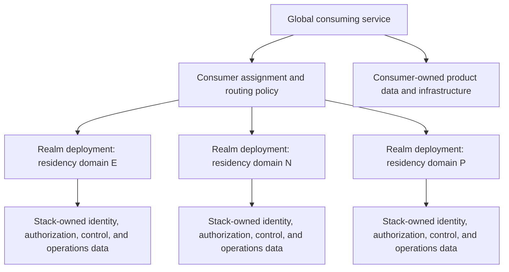

# Global Realm Data Residency - Plan

## Goal Capsule

- **Objective:** Define the product boundary that lets global services deploy identity and authorization realms within chosen residency domains without making the stack responsible for data owned by consuming applications.
- **Product authority:** The maintainer-approved realm model and responsibility split in this contract govern later residency planning. Jurisdiction-specific legal advice and the consumer's own compliance program remain separate authorities.
- **Open blockers:** None for planning the stack capability. Exact jurisdiction profiles, cloud and sovereign-provider mappings, production datastore versions, and migration procedures are deferred to later planning.

---

## Product Contract

### Summary

The stack will make a realm deployment the enforceable residency boundary for stack-owned identity, authorization, and operational data. Global services will compose multiple realm deployments, while each consumer remains responsible for placing and governing its own application data and infrastructure.

### Problem Frame

The typical consumer will operate across several large markets whose privacy, localization, government-access, and cross-border-transfer rules differ and can change. A topology that depends on routinely transferring regulated data to a distant region can therefore create expensive emergency migrations when law, regulator guidance, adequacy status, contractual safeguards, or customer commitments change.

Identity and authorization infrastructure cannot promise end-to-end residency by itself. Kratos and SpiceDB own only part of a service's regulated data surface; the consuming application also creates profiles, transactions, documents, logs, analytics, queues, and support records. The stack needs a strict boundary that makes its own guarantees testable without obscuring the consumer's obligations.

<!-- ce-section: work-relationships -->
### How This Work Fits Together

This contract owns the product boundary for future residency capabilities. It does not commit a delivery roadmap or expand the active local/test milestone.

- **Can proceed independently of this contract:** Milestone 2's pinned local Kratos and SpiceDB fixture, provided it uses synthetic data and makes no residency or production claim.
- **Depends on this contract:** A later production-profile plan that selects datastore, cloud, backup, key, access, telemetry, and evidence implementations for named residency domains.
- **Shares the boundary with this contract:** Future realm routing, relocation, federation, privacy, audit, and operational plans must preserve the stack-versus-consumer responsibility split.
- **Still to decide:** Exact markets, jurisdiction profiles, global metadata, providers, production versions, and migration procedures.

### Actors

- A1. **Stack operator:** deploys and operates one or more realms and selects an approved residency profile for each realm.
- A2. **Consuming service:** assigns tenants or users to realms according to its legal and business policy, routes their requests, and keeps application-owned data within compatible infrastructure.
- A3. **Data subject:** uses a global service whose identity and authorization state is processed by the assigned realm.
- A4. **Compliance and security reviewer:** evaluates the effective realm profile, transfer paths, access paths, evidence, and consumer-owned dependencies against applicable obligations.
- A5. **Stack maintainer:** defines supported realm capabilities and evidence contracts without making jurisdiction-specific legal determinations for consumers.

### Key Decisions

- **Residency attaches to a realm deployment, not to rows inside a shared global Kratos or SpiceDB database.** (session-settled: user-approved — chosen over row-level global partitioning: isolation is easier to verify, migrate, and keep compatible with upstream-managed schemas.) Governs R1-R4, R10.
- **The stack guarantees residency only for data and operational surfaces it owns.** (session-settled: user-approved — chosen over an end-to-end compliance claim: consumer applications create and move data outside the stack boundary.) Governs R5-R8, R13.
- **CockroachDB is an optional production profile within one residency domain, not the mandatory global datastore.** (session-settled: user-approved — chosen over one worldwide cluster: CockroachDB's placement, operational, and licensing constraints must not become the compliance boundary.) Governs R9-R11, R15.
- **Portable regional PostgreSQL is the intended baseline production profile.** (session-settled: user-approved — chosen over CockroachDB as the baseline: consumers need a widely available path that does not depend on multi-region features or a vendor-specific license.) Governs R9, R12, R15.
- **Milestone 2 remains a synthetic local component fixture with no residency or production-compliance claim.** (session-settled: user-approved — chosen over expanding the local milestone: production residency requires its own topology, operations, and evidence plan.) Governs R14.

### Requirements

**Realm boundary and placement**

- R1. Each production realm must have one declared residency domain that defines the allowed locations and access boundaries for all stack-owned data copies and operational surfaces associated with that realm.
- R2. A global service must span residency domains through separate realm deployments rather than through one Kratos or SpiceDB datastore shared across domains.
- R3. The stack must expose machine-readable realm residency metadata so consuming services and reviewers can identify the domain and supported profile of the realm they are using.
- R4. The stack must support realm-level export, relocation, restoration, and deletion contracts that preserve the declared domain boundary and make cross-domain movement explicit and reviewable.

**Stack-owned responsibility**

- R5. The stack's residency contract must cover Kratos identity, credential, session, recovery, and verification data, including replicas, backups, exports, and derived operational copies.
- R6. The contract must cover SpiceDB schemas and relationships, including replicas, backups, exports, and consistency-related copies.
- R7. The contract must cover eventual control-plane state and every stack-owned log, audit record, telemetry stream, support path, administrative access path, encryption key, and backup that can contain or expose realm data.
- R8. A supported profile must provide evidence for data location, replication, backup, key custody, operator and support access, telemetry destinations, and every declared transfer path; encryption alone must not reclassify a cross-domain copy as resident.

**Datastore profiles and portability**

- R9. Production profiles must keep Kratos, SpiceDB, and eventual control-plane logical databases and credentials separate even when an operator chooses to place them on one physical database cluster.
- R10. A CockroachDB profile may span several regions only when every node, replica, backup, metadata exposure, key location, and operator access path remains permitted inside the same residency domain.
- R11. The stack must not modify upstream-managed Kratos or SpiceDB schemas to add row-locality semantics, and it must not represent spatial or GIS features as residency controls.
- R12. The stack must retain a tested regional PostgreSQL path so a realm can be operated without CockroachDB and can be migrated without changing the realm's product contract.

**Consumer responsibility and claims**

- R13. The consuming service must own the legal and business rule that assigns a tenant or user to a residency domain, plus the residency of its product databases, profiles, documents, transactions, caches, queues, analytics, CDN, application logs, support systems, and cross-realm workflows.
- R14. Local and test profiles must use synthetic data and state that they provide component compatibility evidence only; they must not imply production residency, GDPR compliance, or compliance with any other jurisdiction.
- R15. Every supported production profile must publish its datastore license and operational constraints and must avoid claiming that use of a particular database, cloud region, or encryption feature alone establishes legal compliance.

### Residency Responsibility Boundary

The realm branches represent independent enforcement boundaries, not a fixed list of jurisdictions. The consumer branch remains outside the stack guarantee even when the consumer chooses the same database or cloud regions.

### Key Flows

- F1. **Realm selection and request routing**
  - **Trigger:** A tenant or user first enters a consuming service or has an approved domain change.
  - **Actors:** A1, A2, A3
  - **Steps:** The consumer applies its assignment policy, resolves one realm's residency metadata, stores the assignment outside stack identity data as appropriate, and routes stack interactions only to that realm.
  - **Outcome:** Stack-owned data is created in one declared residency domain while consumer-owned data follows the consumer's separate placement policy.
  - **Covered by:** R1-R3, R13
- F2. **Realm deployment and evidence review**
  - **Trigger:** An operator creates, upgrades, or recertifies a supported production realm profile.
  - **Actors:** A1, A4, A5
  - **Steps:** The operator selects the domain and datastore profile, verifies all data and access paths, and produces evidence for the effective topology and constraints.
  - **Outcome:** The profile is supportable only if every stack-owned surface fits the declared domain.
  - **Covered by:** R1, R5-R10, R12, R15
- F3. **Realm relocation**
  - **Trigger:** Law, customer commitments, risk policy, or business needs require a realm to move.
  - **Actors:** A1, A2, A4
  - **Steps:** The operator invokes the separately planned relocation contract, the consumer coordinates its own dependencies and routing, and reviewers verify both the destination and disposition of old copies.
  - **Outcome:** No cross-domain movement is implicit, and neither party mistakes the stack migration for migration of consumer-owned data.
  - **Covered by:** R4, R8, R13

### Acceptance Examples

- AE1. **Covers R1-R3.** Given a service with European and North American obligations, when it provisions one realm for each approved domain, then each realm reports distinct residency metadata and has no shared Kratos or SpiceDB datastore spanning the two domains.
- AE2. **Covers R5-R8.** Given a realm whose primary database is in an allowed region but whose backup, telemetry, support access, or key custody leaves the domain, when the profile is reviewed, then it fails the stack residency contract rather than passing because the primary rows are local.
- AE3. **Covers R9-R12.** Given a CockroachDB deployment with nodes in several regions, when all regions and operational paths are inside one declared domain, then it may qualify as that domain's optional profile; a cluster spanning two independent residency domains does not qualify.
- AE4. **Covers R4, R8, R13.** Given a realm relocation, when the stack data has moved but a consumer queue, application database, analytics copy, or old backup remains in the former domain, then the stack reports only its own relocation complete and the consumer's overall migration remains incomplete.
- AE5. **Covers R11, R15.** Given CockroachDB spatial indexes or row-locality features are available, when a profile is documented, then those features are not cited as proof of Kratos or SpiceDB residency and no upstream-managed schema is altered to use them.
- AE6. **Covers R14.** Given the Milestone 2 SQLite and memdb fixture passes all smoke checks, when its evidence is published, then it is labeled local component-fixture compatibility and makes no production residency or regulatory compliance claim.

### Success Criteria

- A later production planner can define a realm profile without inventing who owns application data or whether a global shared identity database is permitted.
- A compliance reviewer can enumerate every stack-owned location, copy, key, telemetry destination, and privileged access path for a realm from its declared profile and evidence.
- A consumer can align its application infrastructure with the realm metadata without assuming that the stack governs product data or supplies legal advice.
- A realm can adopt regional PostgreSQL or an approved CockroachDB profile without changing the product-level residency boundary.

### Scope Boundaries

**Deferred for later planning**

- Exact residency-domain definitions for the European Economic Area, United Kingdom, United States, Canada, China, India, Japan, Singapore, Australia, and other markets.
- Distinct residency, data-localization, sovereignty, sector, government-access, and customer-contract profiles.
- Cloud-region and sovereign-provider qualification matrices, production network topology, database versions, backup products, key-management systems, support models, and migration runbooks.
- The global realm directory, federation and account-linking model, cross-realm identity behavior, disaster-recovery exceptions, and minimum global metadata budget.
- Data-subject request coordination, retention schedules, audit export, legal-hold behavior, and jurisdiction-specific transfer mechanisms.

**Outside this stack's identity**

- Certifying that a consumer is GDPR-compliant or compliant with any other law.
- Choosing the consumer's lawful basis, transfer mechanism, retention schedule, domain-assignment rule, or response to a regulatory change.
- Hosting, partitioning, migrating, or deleting consumer-owned application data and infrastructure.
- Treating a database feature, cloud-region label, encryption setting, or contractual term as sufficient proof of residency without operational evidence.

### Dependencies and Assumptions

- Residency requirements change and may differ by data type, sector, customer contract, and regulator interpretation; supported profiles therefore require versioned legal and operational review outside this product contract.
- Some global operations may require limited cross-domain metadata, but its permitted content and topology have not been decided and must not be inferred from this contract.
- Upstream Kratos and SpiceDB datastore support, schema ownership, backup behavior, and upgrade semantics constrain which production profiles can be supported.
- CockroachDB licensing and data-placement semantics can change; each tested profile needs a current license, advisory, topology, and metadata-exposure review.

### Outstanding Questions

#### Resolve Before Planning

None.

#### Deferred to Planning

- Which residency domains and regulatory profiles should the first production release support?
- Which regional PostgreSQL and CockroachDB versions, providers, topologies, and migration directions should be tested?
- What is the smallest global realm directory, and which metadata may it hold outside a realm?
- How should a realm relocation coordinate downtime, credential rotation, old-copy destruction, consumer routing, and audit evidence?
- Which stack-owned logs, telemetry, support workflows, and administrative functions are permitted for each profile?

### Sources and Research

**Repository authorities**

- `STRATEGY.md` - one-deployment-per-realm direction and deferred production topology.
- `docs/architecture/decisions/0001-one-deployment-per-realm.md` - realm isolation boundary.
- `docs/architecture/decisions/0002-kratos-identity-lifecycle.md` - Kratos ownership boundary.
- `docs/architecture/decisions/0003-spicedb-application-authorization.md` - SpiceDB and consumer enforcement boundary.
- `docs/architecture/decisions/0007-upstream-upgrade-independence.md` - upstream schema and deployment independence.
- `docs/plans/2026-08-14-0647-feat-pinned-local-development-environment-plan.md` - local/test fixture boundary and deferred production topology.

**Primary external sources, reviewed 2026-08-14**

- [European Data Protection Board guidelines on international transfers](https://www.edpb.europa.eu/sme-data-protection-guide/international-data-transfers_en) - transfer obligations extend beyond the location of a primary database.
- [Ory Kratos production database support](https://www.ory.com/kratos) - PostgreSQL, MySQL, and CockroachDB are supported production datastores.
- [SpiceDB datastore guidance](https://authzed.com/docs/spicedb/concepts/datastores) - PostgreSQL is recommended for single-region operation and CockroachDB for multi-region operation.
- [CockroachDB data domiciling](https://www.cockroachlabs.com/docs/v26.2/data-domiciling) - locality controls have documented metadata and replication limitations that must be evaluated as part of a domain profile.
- [CockroachDB multi-region overview](https://www.cockroachlabs.com/docs/stable/multiregion-overview/) - multi-region features are topology tools rather than independent legal guarantees.
- [CockroachDB licensing FAQ](https://www.cockroachlabs.com/docs/stable/licensing-faqs) - current use is subject to the CockroachDB Software License and organization and environment constraints.
- [CockroachDB spatial indexes](https://www.cockroachlabs.com/docs/stable/spatial-indexes) - geospatial query features are separate from data residency controls.
